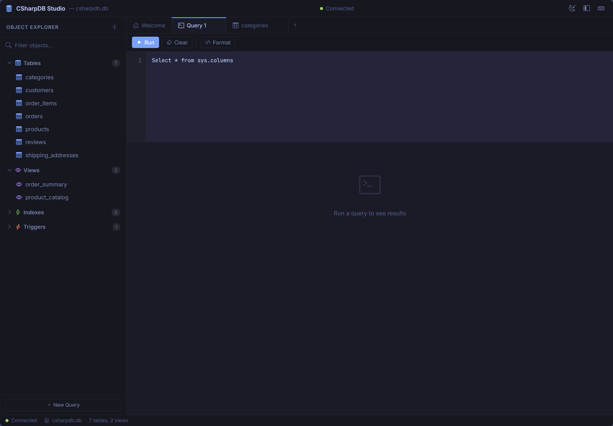
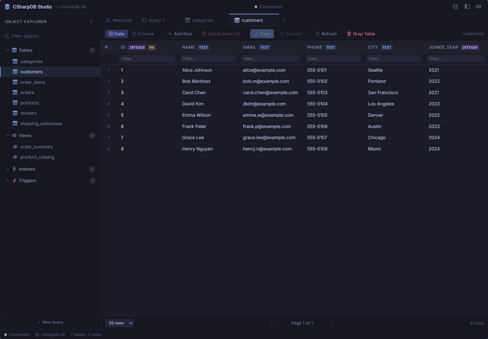
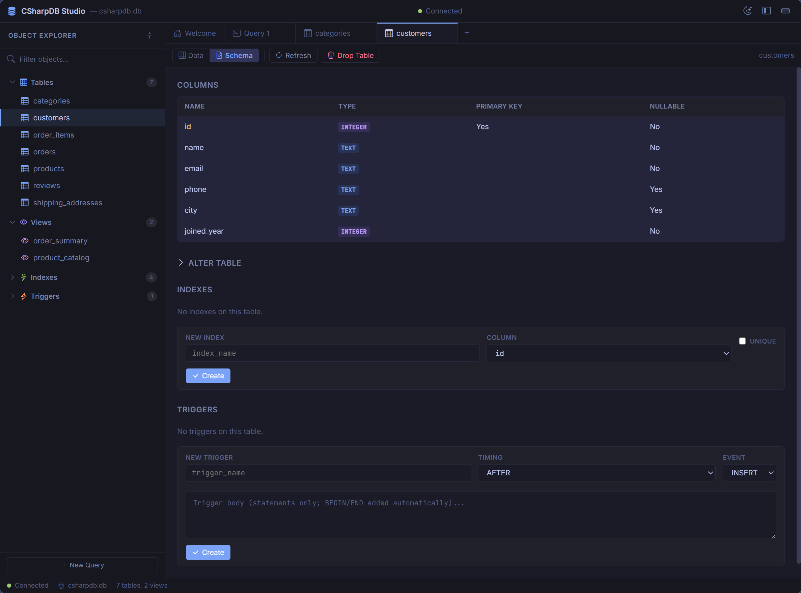

# CSharpDB

A lightweight, embedded SQL database engine written from scratch in C#. Single-file storage, WAL-based crash recovery, concurrent readers, async-first API, zero external dependencies, and a NativeAOT-backed VS Code extension for local IDE workflows.

[](https://dotnet.microsoft.com/download/dotnet/10.0)
[](LICENSE)
[](https://github.com/MaxAkbar/CSharpDB/releases/latest)
[](https://www.nuget.org/packages/CSharpDB)

---

## Why CSharpDB?

CSharpDB is a fully self-contained database engine that runs inside your .NET application — no server process, no external dependencies, just a single `.db` file on disk. It provides two data-access paths: a **full SQL engine** with JOINs, aggregates, views, triggers, and indexes, and a **NoSQL Collection API** that bypasses SQL entirely for sub-microsecond key-value reads.

**Use cases:**

- Embedded databases for mobile, desktop, CLI, or IoT applications
- Prototyping and local development without setting up a database server
- Educational reference for understanding database internals (storage engines, B+trees, WAL, query planning)
- Local IDE tooling through the VS Code extension, which talks directly to the embedded NativeAOT library
- Cross-language interoperability via the native C library, REST API, or Node.js package

## Features

| Category | Details |
|----------|---------|
| **Storage** | Single `.db` file, 4 KB page-oriented, B+tree-backed tables and indexes |
| **Durability** | Write-Ahead Log (WAL) with fsync-on-commit, automatic crash recovery |
| **Concurrency** | Single writer + concurrent snapshot-isolated readers via WAL-based MVCC |
| **SQL** | DDL, DML, JOINs, aggregates, `DISTINCT`, GROUP BY, HAVING, CTEs, views, triggers, composite indexes, scalar `TEXT(...)`, and `sys.*` catalog queries |
| **NoSQL** | Typed `Collection<T>` with Put/Get/Delete/Scan/Find — 1.44M reads/sec |
| **ADO.NET** | Standard `DbConnection`/`DbCommand`/`DbDataReader` provider |
| **Client SDK** | `CSharpDB.Client` — unified API with pluggable transports (Direct, HTTP, gRPC, TCP, Named Pipes), with gRPC hosted by `CSharpDB.Daemon` |
| **Native FFI** | NativeAOT-compiled C library (`.dll`/`.so`/`.dylib`/static lib) — use CSharpDB from Python, Node.js, Go, Rust, Swift, Kotlin, Dart, Android, iOS, and more |
| **Node.js Client** | TypeScript/JavaScript package (`csharpdb`) wrapping the native library via koffi |
| **VS Code Extension** | NativeAOT-backed local extension with auto-connect, schema explorer, `.csql` language support, query results, data browser CRUD, table designer, and storage diagnostics |
| **REST API** | ASP.NET Core Minimal API with 33 endpoints, OpenAPI/Scalar UI |
| **gRPC Daemon** | `CSharpDB.Daemon` - dedicated gRPC host for remote `CSharpDB.Client` access |
| **MCP Server** | Model Context Protocol server — let AI assistants query and modify your database |
| **Admin UI** | Blazor Server dashboard for table/view browsing, schema editing, procedures, saved queries, and storage inspection |
| **Procedures** | Table-backed stored procedure catalog (`__procedures`) with typed params and transactional execution |
| **CLI** | Interactive REPL with meta-commands, file execution, snapshot mode, remote connectivity |
| **Dependencies** | Zero — pure .NET 10, nothing else |

## Compatibility Notice

- New application code should target `CSharpDB.Client`.
- New low-level/shared-type usage should target `CSharpDB.Primitives`.
- `CSharpDB.Service` and the `CSharpDB.Core` compatibility package remain available in `v1.x`, but both are planned for removal in `v2.0.0`.

## Admin UI Preview

See the product first, then dive into the API and internals:

| Querying Metadata | Table Data View | Table Schema View |
|---|---|---|
|  |  |  |

Planned next for the Admin query surface: a classic visual [Query Designer](docs/query-designer/README.md) with a source canvas, join lines, design grid, SQL preview, and saved layouts.

## VS Code Extension

The repo includes a local VS Code extension in [`vscode-extension/`](vscode-extension/) that runs inside the VS Code extension host and connects directly to [`CSharpDB.Native`](src/CSharpDB.Native/README.md) through the embedded C API. There is no REST API or daemon in the local extension path.

The current implementation supports auto-connecting to workspace `.db` files, a schema explorer for tables, columns, views, indexes, triggers, and procedures, `.csql` syntax highlighting/completion/hover help, a query results panel, a data browser with CRUD for tables and read-only view browsing, a table designer, and storage diagnostics. It is also a practical end-to-end example of using CSharpDB through NativeAOT from a non-.NET host. See [vscode-extension/README.md](vscode-extension/README.md) for setup and [vscode-extension/DEVELOPMENT.md](vscode-extension/DEVELOPMENT.md) for the maintainer workflow.

## Quick Start

Install the recommended entry package:

```bash
dotnet add package CSharpDB
```

### Engine API

```csharp
using CSharpDB.Engine;

await using var db = await Database.OpenAsync("mydata.db");

await db.ExecuteAsync("CREATE TABLE users (id INTEGER PRIMARY KEY, name TEXT, age INTEGER)");
await db.ExecuteAsync("INSERT INTO users VALUES (1, 'Alice', 30)");
await db.ExecuteAsync("INSERT INTO users VALUES (2, 'Bob', 25)");

await using var result = await db.ExecuteAsync(
    "SELECT * FROM users WHERE age > 26 ORDER BY name ASC");

await foreach (var row in result.GetRowsAsync())
    Console.WriteLine($"{row[0].AsInteger}: {row[1].AsText}, age {row[2].AsInteger}");
// 1: Alice, age 30
```

### Collection API (NoSQL)

```csharp
var users = await db.GetCollectionAsync<User>("users");

await users.PutAsync("user:1", new User("Alice", 30, "alice@example.com"));
var alice = await users.GetAsync("user:1");

await foreach (var kvp in users.FindAsync(u => u.Age > 25))
    Console.WriteLine(kvp.Value.Name);

record User(string Name, int Age, string Email);
```

### ADO.NET Provider

```csharp
using CSharpDB.Data;

await using var conn = new CSharpDbConnection("Data Source=myapp.db");
await conn.OpenAsync();

using var cmd = conn.CreateCommand();
cmd.CommandText = "SELECT * FROM users WHERE age > @age";
cmd.Parameters.AddWithValue("@age", 25);

await using var reader = await cmd.ExecuteReaderAsync();
while (await reader.ReadAsync())
    Console.WriteLine($"{reader.GetInt64(0)}: {reader.GetString(1)}");
```

### REST API

```bash
# Start the API server
dotnet run --project src/CSharpDB.Api

# Create a table
curl -X POST http://localhost:61818/api/sql/execute \
  -H "Content-Type: application/json" \
  -d '{"sql": "CREATE TABLE users (id INTEGER PRIMARY KEY, name TEXT)"}'

# Insert a row
curl -X POST http://localhost:61818/api/tables/users/rows \
  -H "Content-Type: application/json" \
  -d '{"values": {"id": 1, "name": "Alice"}}'

# Browse rows
curl http://localhost:61818/api/tables/users/rows
```

### CLI

```bash
# Local database
dotnet run --project src/CSharpDB.Cli -- mydata.db

# Connect to a remote CSharpDB server
dotnet run --project src/CSharpDB.Cli -- --endpoint http://localhost:61818

csdb> CREATE TABLE demo (id INTEGER PRIMARY KEY, name TEXT);
csdb> INSERT INTO demo VALUES (1, 'Hello');
csdb> SELECT * FROM demo;
csdb> .tables
csdb> .quit
```

### MCP Server (AI Integration)

Connect AI assistants like Claude Desktop, Cursor, OpenAI Codex, LM Studio, or VS Code Copilot to your database:

```bash
dotnet run --project src/CSharpDB.Mcp -- --database mydata.db
```

Add to `claude_desktop_config.json` (or `.mcp.json` for Claude Code / Cursor):

```json
{
  "mcpServers": {
    "csharpdb": {
      "command": "dotnet",
      "args": ["run", "--project", "path/to/src/CSharpDB.Mcp", "--", "--database", "mydata.db"]
    }
  }
}
```

Or for OpenAI Codex CLI (`~/.codex/config.toml`):

```toml
[mcp_servers.csharpdb]
command = "dotnet"
args = ["run", "--project", "path/to/src/CSharpDB.Mcp", "--", "--database", "mydata.db"]
```

The MCP server exposes 15 tools for schema inspection, data browsing, row mutations, and SQL execution. See the [MCP Server Reference](docs/mcp-server.md) for the full tool list and configuration options for all supported clients.

### Client SDK

The unified `CSharpDB.Client` SDK provides a single `ICSharpDbClient` interface with pluggable transports:

```csharp
using CSharpDB.Client;

// Direct (in-process) — default
var client = CSharpDbClient.Create(new CSharpDbClientOptions
{
    DataSource = "mydata.db"
});

// All database operations go through the client
var tables = await client.GetTableNamesAsync();
var result = await client.ExecuteSqlAsync("SELECT * FROM users WHERE age > 25");
await client.InsertRowAsync("users", new Dictionary<string, object?>
{
    ["id"] = 3, ["name"] = "Charlie", ["age"] = 28
});

// DI registration
services.AddCSharpDbClient(new CSharpDbClientOptions { DataSource = "mydata.db" });
```

The transport layer supports Direct (in-process), HTTP, gRPC, TCP, and Named Pipes.

Current host mapping:

- `CSharpDB.Api` is the REST/HTTP host
- `CSharpDB.Daemon` is the gRPC host used by `CSharpDB.Client` when `Transport = Grpc`

Direct is fully implemented. gRPC is available through `CSharpDB.Daemon`. The other network transports remain part of the client contract and broader service-daemon roadmap.

### gRPC Daemon

Start the daemon host:

```bash
dotnet run --project src/CSharpDB.Daemon
```

Connect to it from `CSharpDB.Client`:

```csharp
using CSharpDB.Client;

await using var client = CSharpDbClient.Create(new CSharpDbClientOptions
{
    Transport = CSharpDbTransport.Grpc,
    Endpoint = "https://localhost:49995"
});

var info = await client.GetInfoAsync();
var tables = await client.GetTableNamesAsync();
```

For local admin + daemon startup, see [scripts/README.md](scripts/README.md).

### Cross-Language Interop (Native FFI)

CSharpDB compiles to a standalone native library via NativeAOT — no .NET runtime required at the call site. Any language with C FFI support can use it.

The VS Code extension in [`vscode-extension/`](vscode-extension/) is another concrete NativeAOT consumer: it runs inside VS Code and talks to the same embedded C API directly for local schema browsing, query execution, data editing, and diagnostics.

Mobile deployment is supported as well. .NET MAUI apps can reference `CSharpDB` directly for an on-device embedded database, while non-.NET Android apps can load the NativeAOT `.so` and iOS apps can statically link the `ios-arm64` native output into an Xcode project. See the [Native Library Reference](src/CSharpDB.Native/README.md) for Android and iOS build details.

**Node.js (via `csharpdb` package):**

```javascript
import { Database } from 'csharpdb';

const db = new Database('mydata.db');
db.execute('CREATE TABLE demo (id INTEGER PRIMARY KEY, name TEXT)');
db.execute("INSERT INTO demo VALUES (1, 'Alice')");

for (const row of db.query('SELECT * FROM demo'))
  console.log(row);

db.close();
```

**Python (via ctypes — zero dependencies):**

```python
from csharpdb import Database

with Database("mydata.db") as db:
    db.execute("CREATE TABLE demo (id INTEGER PRIMARY KEY, name TEXT)")
    db.execute("INSERT INTO demo VALUES (1, 'Alice')")
    for row in db.query("SELECT * FROM demo"):
        print(row)
```

The native library exports 20 C functions covering database lifecycle, SQL execution, result iteration, transactions, and error handling. See the [Native Library Reference](src/CSharpDB.Native/README.md) for the full API, build instructions, and examples for C, Go, Rust, Swift, Kotlin, and Dart.

## Architecture

```
  SQL string              Collection<T> API
      │                        │
  [Tokenizer]   ── Sql     [JSON serialize]  ── Engine
      │                        │
  [Parser → AST]          (bypassed)
      │                        │
  [Query Planner]  ── Execution   (bypassed)
      │                        │
  [Operator Tree]              │
      │                        │
  [B+Tree]  ───────────────  [B+Tree]  ── Storage
      │
  [Pager + WAL]        (page cache, dirty tracking, write-ahead log)
      │
  [File I/O]           (4 KB pages, slotted page layout)
      │
  mydata.db + mydata.db.wal
```

The SQL path goes through tokenizer → parser → planner → operators → B+tree. The Collection API goes directly to the B+tree, bypassing SQL entirely for maximum throughput.

## Project Structure

```
CSharpDB.slnx
├── src/
│   ├── CSharpDB.Core/        Primitives (DbValue, Schema, ErrorCodes)
│   ├── CSharpDB/             All-in-one NuGet package metadata
│   ├── CSharpDB.Storage/     Pager, B+tree, WAL, file I/O
│   ├── CSharpDB.Sql/         Tokenizer, parser, AST, script splitter
│   ├── CSharpDB.Execution/   Query planner, operators, expression evaluator
│   ├── CSharpDB.Engine/      Top-level Database API + Collection<T> (NoSQL)
│   ├── CSharpDB.Client/      Unified client SDK with transport abstraction
│   ├── CSharpDB.Data/        ADO.NET provider (DbConnection, DbCommand, DbDataReader)
│   ├── CSharpDB.Native/      NativeAOT C FFI library for cross-language interop
│   ├── CSharpDB.Storage.Diagnostics/ Storage diagnostics and integrity checking
│   ├── CSharpDB.Cli/         Interactive REPL with remote connectivity
│   ├── CSharpDB.Service/     Compatibility facade over CSharpDB.Client (planned removal in v2.0.0)
│   ├── CSharpDB.Admin/       Blazor Server admin dashboard
│   ├── CSharpDB.Api/         REST API (ASP.NET Core Minimal API)
│   ├── CSharpDB.Daemon/      gRPC daemon host for remote `CSharpDB.Client` access
│   └── CSharpDB.Mcp/         MCP server for AI assistant integration
├── clients/
│   └── node/                  Node.js/TypeScript client package (csharpdb)
├── vscode-extension/          VS Code extension using the NativeAOT library for local IDE tooling
├── tests/
│   ├── CSharpDB.Tests/       Engine unit + integration tests
│   ├── CSharpDB.Data.Tests/  ADO.NET provider tests
│   ├── CSharpDB.Cli.Tests/   CLI smoke + integration tests
│   └── CSharpDB.Benchmarks/  Performance benchmarks (BenchmarkDotNet + custom)
├── samples/                   Sample SQL datasets
└── docs/                      Documentation + FFI tutorials
```

## Supported SQL

| Category | Syntax |
|----------|--------|
| **DDL** | `CREATE TABLE`, `DROP TABLE`, `ALTER TABLE` (ADD/DROP/RENAME COLUMN, RENAME TO) |
| **DML** | `INSERT INTO ... VALUES`, `SELECT`, `UPDATE ... SET`, `DELETE FROM` |
| **Indexes** | `CREATE [UNIQUE] INDEX`, `DROP INDEX` |
| **Views** | `CREATE VIEW ... AS`, `DROP VIEW` |
| **Triggers** | `CREATE TRIGGER ... BEFORE/AFTER INSERT/UPDATE/DELETE ... BEGIN ... END` |
| **CTEs** | `WITH name AS (select) SELECT ...` |
| **JOINs** | `INNER JOIN`, `LEFT JOIN`, `RIGHT JOIN`, `CROSS JOIN` |
| **Aggregates** | `COUNT(*)`, `COUNT(col)`, `COUNT(DISTINCT col)`, `SUM`, `AVG`, `MIN`, `MAX` |
| **Scalar Functions** | `TEXT(expr)` |
| **Modifiers** | `SELECT DISTINCT` |
| **Clauses** | `WHERE`, `GROUP BY`, `HAVING`, `ORDER BY`, `LIMIT`, `OFFSET` |
| **Expressions** | `=`, `<>`, `<`, `>`, `<=`, `>=`, `AND`, `OR`, `NOT`, `LIKE`, `IN`, `BETWEEN`, `IS NULL` |
| **Types** | `INTEGER` (i64), `REAL` (f64), `TEXT` (UTF-8), `BLOB` (byte[]) |

### System Catalog Queries

Use SQL to inspect schema metadata:

```sql
SELECT * FROM sys.tables ORDER BY table_name;
SELECT * FROM sys.columns WHERE table_name = 'users' ORDER BY ordinal_position;
SELECT * FROM sys.indexes WHERE table_name = 'users';
SELECT * FROM sys.views;
SELECT * FROM sys.triggers;
SELECT * FROM sys.objects ORDER BY object_type, object_name;
```

Underscored aliases are also supported: `sys_tables`, `sys_columns`, `sys_indexes`, `sys_views`, `sys_triggers`, `sys_objects`.

## Building and Testing

Requires [.NET 10 SDK](https://dotnet.microsoft.com/download/dotnet/10.0).

```bash
dotnet build
dotnet run --project tests/CSharpDB.Tests/CSharpDB.Tests.csproj --
dotnet run --project tests/CSharpDB.Data.Tests/CSharpDB.Data.Tests.csproj --
dotnet run --project tests/CSharpDB.Cli.Tests/CSharpDB.Cli.Tests.csproj --
```

## Performance Highlights

Benchmarks run on Intel i9-11900K, .NET 10, Windows 11. Full results in [tests/CSharpDB.Benchmarks/README.md](tests/CSharpDB.Benchmarks/README.md).

| Metric | Result |
|--------|--------|
| Single INSERT (auto-commit, durable) | 27,842 ops/sec |
| Batched INSERT (100 rows/tx) | ~370K rows/sec |
| Point lookup by PK (1K rows) | 786,596 ops/sec |
| Collection `GetAsync` (10K docs) | 1,371,530 ops/sec |
| Concurrent readers (8 sessions) | 256,088 ops/sec |
| ADO.NET `ExecuteScalar` | 323 ns / 696 bytes |
| Crash recovery | 100% reliable (50/50 cycles), P50 = 11.5 ms |

## Samples

The [`samples/`](samples/) directory now includes both realistic datasets and a full-fidelity fictitious company example. Each sample lives in its own folder with `schema.sql` plus companion `procedures.json` and optional `queries.sql` files.

- **[ecommerce-store/schema.sql](samples/ecommerce-store/schema.sql)** — retail schema with procedures, views, and inventory-style triggers
- **[medical-clinic/schema.sql](samples/medical-clinic/schema.sql)** — appointments, billing, and procedure-driven updates
- **[school-district/schema.sql](samples/school-district/schema.sql)** — schedules, enrollments, attendance, and defaulted procedure params
- **[feature-tour/schema.sql](samples/feature-tour/schema.sql)** — Northstar Field Services, a fictitious multi-region field service company with customer sites, contracts, dispatch, inventory, billing workflows, triggers, procedures, and `TEXT(...)` filtering

Companion assets:

- Per-sample `procedures.json` files for procedure catalog import
- **[feature-tour/queries.sql](samples/feature-tour/queries.sql)** for ready-to-run workbook queries
- **[run-sample.csx](samples/run-sample.csx)** for REST API import of SQL + procedures

See the [samples README](samples/README.md) for loading options through the API, CLI, and `CSharpDB.Client`.

## Roadmap

See [docs/roadmap.md](docs/roadmap.md) for the full roadmap and status.

**Recently completed**
- Unified Client SDK (`CSharpDB.Client`) with transport abstraction
- NativeAOT C FFI library (`CSharpDB.Native`) for cross-language interop
- Node.js/TypeScript client package (`csharpdb`)
- NativeAOT-backed VS Code extension for local schema, query, data, and diagnostics workflows
- CLI remote connectivity (`--endpoint`, `--transport`)
- SQL script splitter and statement classifier (`CSharpDB.Sql`)
- Service layer refactor to facade over `CSharpDB.Client`
- CI pipeline for cross-platform native library builds
- `SELECT DISTINCT`, composite indexes, prepared statement caching

**In progress**
- Broader index range-scan planning (`<`, `>`, `<=`, `>=`, `BETWEEN`)
- Service daemon for persistent background hosting (HTTP/gRPC/TCP/Named Pipes)
- Network transport implementations for `CSharpDB.Client`

**Still planned**
- B+tree delete rebalancing
- Python and Go client packages

**Mid-term**
- Visual query designer for Admin UI ([plan](docs/query-designer/README.md))
- Subqueries and `EXISTS`
- `UNION` / `INTERSECT` / `EXCEPT`
- Window functions (`ROW_NUMBER`, `RANK`)

**Long-term**
- Memory-mapped I/O (mmap) read path
- Full-text search
- JSON path querying for Collection API
- Secondary indexes for Collection API

## Documentation

| Document | Description |
|----------|-------------|
| [Getting Started Tutorial](docs/getting-started.md) | Step-by-step walkthrough from opening a database to transactions |
| [Architecture Guide](docs/architecture.md) | Layer-by-layer deep dive into the engine design |
| [Internals & Contributing](docs/internals.md) | How to extend the engine, testing strategy, project layout |
| [CSharpDB.Client](src/CSharpDB.Client/README.md) | Unified client API, transport model, and DI integration |
| [CSharpDB.Daemon](src/CSharpDB.Daemon/README.md) | gRPC daemon host runtime model, configuration, and deployment notes |
| [CSharpDB.Native](src/CSharpDB.Native/README.md) | C FFI API, build instructions, and cross-language examples |
| [Node.js Client](clients/node/README.md) | TypeScript/JavaScript package documentation |
| [VS Code Extension](vscode-extension/README.md) | Overview of the local NativeAOT-backed VS Code extension and a concrete AOT integration example |
| [VS Code Extension Development](vscode-extension/DEVELOPMENT.md) | How to build, debug, and modify the extension in this repo |
| [REST API Reference](docs/rest-api.md) | All 33 API endpoints with request/response examples |
| [MCP Server Reference](docs/mcp-server.md) | AI assistant integration via Model Context Protocol |
| [CLI Reference](docs/cli.md) | Interactive REPL commands and meta-commands |
| [Storage Inspector](docs/storage-inspector.md) | Read-only DB/WAL integrity diagnostics and page-level inspection |
| [Service Daemon Design](docs/service-daemon/README.md) | Background service architecture and roadmap |
| [Query Designer Plan](docs/query-designer/README.md) | Detailed Admin UI plan for a classic visual `SELECT` builder with SQL sync |
| [Admin Startup Scripts](scripts/README.md) | Start, stop, and configure the admin site and daemon for local workflows |
| [FFI Tutorials](docs/tutorials/native-ffi/) | Step-by-step JavaScript and Python interop guides |
| [FAQ](docs/faq.md) | Common setup, SQL, Admin UI, and troubleshooting questions |
| [Roadmap](docs/roadmap.md) | Near-term, mid-term, and long-term project goals |
| [Benchmark Suite](tests/CSharpDB.Benchmarks/README.md) | Full benchmark results and comparison with 11 other databases |
| [Sample Datasets](samples/README.md) | Ready-to-run SQL scripts for testing |

## License

[MIT](LICENSE)
