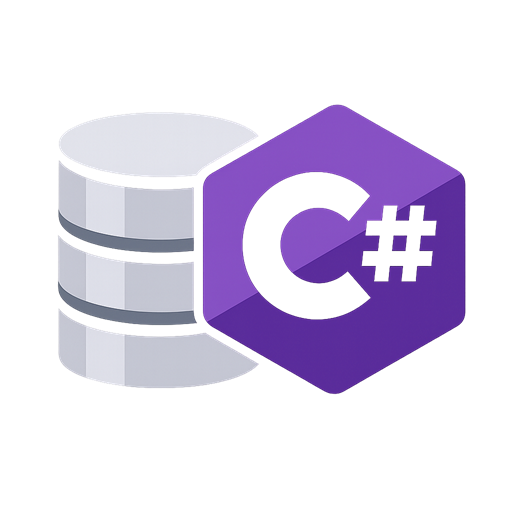

<p align="center">
  
</p>

<h1 align="center">CSharpDB</h1>

<p align="center">
  <strong>The embedded database engine built for .NET</strong><br>
  Zero dependencies. Full SQL. ACID storage. Single file. One NuGet package.
</p>

<p align="center">
  <a href="https://www.nuget.org/packages/CSharpDB"></a>
  <a href="https://dotnet.microsoft.com/download/dotnet/10.0"></a>
  <a href="LICENSE"></a>
  <a href="https://github.com/MaxAkbar/CSharpDB/releases/latest"></a>
</p>

<p align="center">
  <a href="https://csharpdb.com/getting-started.html">Getting Started</a> &middot;
  <a href="https://csharpdb.com/docs/index.html">Docs</a> &middot;
  <a href="https://csharpdb.com/benchmarks.html">Benchmarks</a> &middot;
  <a href="https://csharpdb.com/roadmap.html">Roadmap</a> &middot;
  <a href="https://csharpdb.com">Website</a>
</p>

---

## Performance at a Glance

| 1.93M gets/sec | 11.58M reads/sec | 798.9K inserts/sec | 213.1 ns |
|:-:|:-:|:-:|:-:|
| Collection point reads | Concurrent reader burst (8x reused) | Batched SQL inserts | ADO.NET ExecuteScalar |

<sub>Intel i9-11900K, .NET 10, Windows 11. Snapshot reflects the April 13, 2026 focused storage-mode and durable master-table reruns plus the latest checked-in ADO.NET micro result. Full results live in the <a href="tests/CSharpDB.Benchmarks/README.md">benchmark suite</a>.</sub>

---

## Write Durability Modes

Default CSharpDB benchmarks run in fully durable mode. CSharpDB also supports a less-durable buffered mode for workloads that want much higher write throughput and can tolerate a larger crash-loss window.

| Mode | SQL Single INSERT | SQL Batch x100 | Collection Single PUT | Collection Batch x100 |
|------|------------------:|---------------:|----------------------:|----------------------:|
| Durable (default) | 281.7 ops/sec | 26.07K rows/sec | 281.8 ops/sec | 26.93K docs/sec |
| Buffered | 21.17K ops/sec | 456.63K rows/sec | 19.30K ops/sec | 399.76K docs/sec |

<sub>`Durable` is fsync-on-commit. `Buffered` is less durable and analogous to SQLite WAL `synchronous=NORMAL`. The durable row is from the April 13, 2026 master-table rerun; the buffered row remains from the April 7, 2026 buffered rerun. Full methodology and the complete matrix live in the <a href="tests/CSharpDB.Benchmarks/README.md">benchmark suite README</a>.</sub>

---

## Concurrent Durable Writes

Current concurrent durable-write behavior depends on the write path. The numbers below are total durable commits/sec across all writers combined on one shared `Database` instance.

| Workload | Writers | Durable Commits/sec | Notes |
|----------|--------:|--------------------:|-------|
| Shared auto-commit `INSERT` | 8 | 467.3 | April 10, 2026 closeout best no-preallocation row (`250us`), effectively tied with `0` |
| Shared auto-commit `UPDATE` / `DELETE` | 8 | 743.0 | April 11, 2026 fan-in rerun after the isolated non-insert commit-path work |
| Explicit `WriteTransaction` disjoint update | 8 | 765.0 | Same April 11 rerun; currently the top measured commit-fan-in row |

<sub>The hot insert path is still structural: it stays around one commit per flush on the current runner. Shared non-insert auto-commit and explicit disjoint-update workloads can now build a real pending WAL commit queue. Full methodology and tuning notes live in the <a href="tests/CSharpDB.Benchmarks/README.md">benchmark suite README</a>.</sub>

---

## Quick Start

```bash
dotnet add package CSharpDB
```

```csharp
using CSharpDB.Engine;

// If the file exists, delete it to start fresh
if (File.Exists("mydata.db"))
    File.Delete("mydata.db");

await using var db = await Database.OpenAsync("mydata.db");

await db.ExecuteAsync("CREATE TABLE users (id INTEGER PRIMARY KEY, name TEXT, age INTEGER)");
await db.ExecuteAsync("INSERT INTO users VALUES (1, 'Alice', 30)");

await using var result = await db.ExecuteAsync("SELECT * FROM users WHERE age > 26");
await foreach (var row in result.GetRowsAsync())
    Console.WriteLine($"{row[0].AsInteger}: {row[1].AsText}, age {row[2].AsInteger}");
```

---

## Why CSharpDB?

- **No moving parts** — single `.db` file, no server process, no native binaries, no external dependencies
- **SQL + NoSQL in one engine** — full SQL with JOINs, CTEs, subqueries, views, and triggers *plus* a typed `Collection<T>` API that bypasses SQL entirely for sub-microsecond reads
- **ACID by default** — WAL-based crash recovery with fsync-on-commit and concurrent snapshot-isolated readers
- **Ships with tooling** — Admin UI, VS Code extension, CLI REPL, REST API, gRPC daemon, pipeline tooling, integrated forms and reports designers, and MCP server for AI agents
- **Use from any language** — NativeAOT compiles to a standalone C library; call from Python, Node.js, Go, Rust, Swift, Kotlin, Dart, Android, and iOS

---

## Admin UI

| Querying | Table Data | Schema |
|:-:|:-:|:-:|
|  |  |  |

Blazor Server dashboard with query execution, visual [Query Designer](https://csharpdb.com/docs/admin-ui.html#query-editor), data browser CRUD, schema editing, stored procedures, visual pipeline design, integrated forms and reports designers, backup and maintenance flows, and storage diagnostics.

---

## Ecosystem

CSharpDB is more than an embedded SQL engine. The same database can be used through in-process APIs, remote service hosts, AI tooling, visual designers, and cross-language bindings.

| Surface | Primary use | Highlights |
|---|---|---|
| **Engine API** | Embedded in-process access | Direct async SQL, transactions, views, triggers, procedures, and query stats |
| **Collection API** | Typed document and key-value access | `Collection<T>`, nested path indexes, point reads, scans, and path/range queries |
| **ADO.NET Provider** | Standard .NET data access | `DbConnection`, `DbCommand`, `DbDataReader`, and `DbTransaction` support |
| **Client SDK** | One C# API across transports | Direct, HTTP, and gRPC transports plus maintenance and diagnostics |
| **REST API** | HTTP integration and automation | 30+ endpoints with OpenAPI and Scalar for SQL, schema, data, collections, and maintenance |
| **gRPC Daemon** | Long-running remote host | Strongly typed RPC surface for SQL, schema, procedures, collections, and maintenance |
| **CLI REPL** | Terminal-first workflows | Interactive SQL shell, schema inspection, backup/restore, and migration commands |
| **MCP Server** | AI assistant integration | Tool-based schema inspection, query execution, and row operations for MCP-compatible clients |
| **Admin UI** | Browser-based database studio | Query editor, visual query designer, CRUD, schema editing, procedures, and storage diagnostics |
| **Forms + Reports** | Internal app workflows and printable output | Database-backed forms designer/runtime plus banded reports with grouping, expressions, preview, and print |
| **Pipelines** | ETL and automation | Package-based runtime, visual pipeline designer, transforms, dry-run, checkpoints, and run history |
| **VS Code Extension** | IDE integration | Schema explorer, `.csql` support, query results, CRUD, and storage diagnostics |
| **Native FFI** | Polyglot embedding | NativeAOT C library for Python, Go, Rust, Swift, Kotlin, Dart, Android, and iOS |
| **Node.js Package** | JavaScript and TypeScript access | Local embedded wrapper over the native library for Node.js apps and tooling |

---

## Use from Any Language

**Node.js:**
```javascript
import { Database } from 'csharpdb';

const db = new Database('mydata.db');
db.execute("INSERT INTO demo VALUES (1, 'Alice')");
for (const row of db.query('SELECT * FROM demo')) console.log(row);
db.close();
```

**Python:**
```python
from csharpdb import Database

with Database("mydata.db") as db:
    db.execute("INSERT INTO demo VALUES (1, 'Alice')")
    for row in db.query("SELECT * FROM demo"):
        print(row)
```

The native library exports 20 C functions. See the [Native Library Reference](https://csharpdb.com/docs/tutorials/native-ffi.html) for Go, Rust, Swift, Kotlin, Dart, Android, and iOS examples.

---

## How CSharpDB Compares

| Feature | CSharpDB | SQLite | LiteDB | RocksDB |
|---------|:--------:|:------:|:------:|:-------:|
| Pure .NET / no native binaries | ✅ | ❌ | ✅ | ❌ |
| Full SQL (JOINs, CTEs, subqueries) | ✅ | ✅ | ❌ | ❌ |
| NoSQL Collection API | ✅ | ❌ | ✅ | ❌ |
| ACID transactions | ✅ | ✅ | ✅ | ✅ |
| REST API / gRPC | ✅ | ❌ | ❌ | ❌ |
| Admin UI | ✅ | ❌ | ❌ | ❌ |
| MCP server (AI agents) | ✅ | ❌ | ❌ | ❌ |
| VS Code extension | ✅ | ❌ | ❌ | ❌ |
| Multi-language SDKs | ✅ | ✅ | ❌ | ✅ |
| Mature ecosystem / battle-tested | ❌ | ✅ | ✅ | ✅ |

---

## Architecture

```
  SQL string              Collection<T> API
      |                        |
  [Tokenizer]            [JSON serialize]
      |                        |
  [Parser -> AST]         (bypassed)
      |                        |
  [Query Planner]              |
      |                        |
  [Operator Tree]              |
      |                        |
  [B+Tree]  ---------------  [B+Tree]
      |
  [Pager + WAL]              (page cache, write-ahead log)
      |
  [File I/O]                 (4 KB pages, slotted layout)
      |
  mydata.db + mydata.db.wal
```

---

## Documentation

| | |
|---|---|
| [Getting Started](https://csharpdb.com/getting-started.html) | Step-by-step walkthrough |
| [Architecture Guide](https://csharpdb.com/docs/architecture.html) | Engine design deep dive |
| [Tools & Ecosystem](https://csharpdb.com/docs/ecosystem.html) | APIs, hosts, designers, and integrations |
| [Admin UI Guide](https://csharpdb.com/docs/admin-ui.html) | Querying, schema, pipelines, forms, reports, and storage |
| [CSharpDB.Client](src/CSharpDB.Client/README.md) | Unified client API and transports |
| [Pipelines](https://csharpdb.com/docs/pipelines.html) | ETL package model and visual designer |
| [Reports](https://csharpdb.com/docs/reports.html) | Visual banded report designer and preview |
| [Native FFI](https://csharpdb.com/docs/tutorials/native-ffi.html) | C library API and cross-language examples |
| [REST API Reference](https://csharpdb.com/docs/rest-api.html) | HTTP API, schema/data CRUD, and maintenance |
| [MCP Server](https://csharpdb.com/docs/mcp-server.html) | AI assistant integration |
| [CLI Reference](https://csharpdb.com/docs/cli.html) | REPL commands |
| [VS Code Extension](vscode-extension/README.md) | Local NativeAOT-backed extension |
| [Benchmark Suite](tests/CSharpDB.Benchmarks/README.md) | Full results and comparisons |
| [SQL Reference](https://csharpdb.com/docs/sql.html) | Supported SQL syntax |
| [Internals & Contributing](https://csharpdb.com/docs/internals.html) | Project structure and concurrency model |
| [FAQ](https://csharpdb.com/docs/faq.html) | Common questions |
| [Roadmap](https://csharpdb.com/roadmap.html) | Project goals |

---

## License

[MIT](LICENSE)
