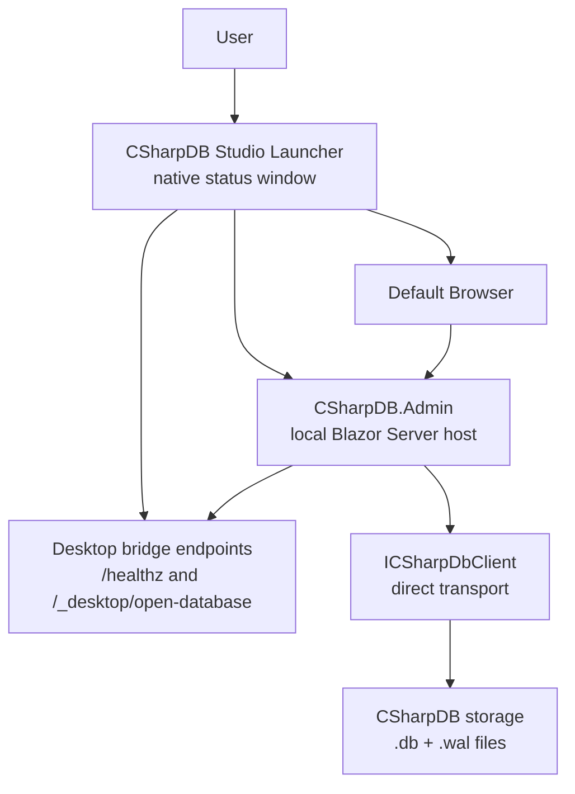

# Mac/Linux CSharpDB Studio Browser Launcher

## Summary

CSharpDB Studio for macOS and Linux should reuse the existing
`CSharpDB.Admin` Blazor Server host and open the Admin UI in the user's default
browser. This keeps the database runtime and Admin application shared with the
Windows package while avoiding a cross-platform embedded WebView requirement.

The desktop app entrypoint is a small native launcher. It starts the Admin host
privately on `127.0.0.1`, waits for readiness, opens the browser, shows local
status and actions, and owns shutdown of the child process.

This plan is documentation only. It does not add the launcher project or
packaging scripts yet.

## Architecture

The Mac/Linux launcher follows the same process-isolation model as the Windows
CSharpDB Studio package:

The launcher should start the Admin host with the same desktop-shell
configuration model used by the Windows package:

- `ASPNETCORE_URLS=http://127.0.0.1:{port}`
- `ConnectionStrings__CSharpDB=Data Source={default-db-path}`
- `CSharpDB__Transport=direct`
- `CSharpDB__DesktopShell=true`
- `CSharpDB__DesktopShellToken={random-token}`
- `DOTNET_ENVIRONMENT=Production`
- `ASPNETCORE_ENVIRONMENT=Production`

The random token is only for native launcher-to-host bridge calls. It must not
be placed in the browser URL.

## Launcher Behavior

The first Mac/Linux implementation should use a native status window rather than
an embedded browser. The window should provide:

- Open Browser
- Open Database
- Copy URL
- Open Logs
- Quit

Startup flow:

1. Create platform-specific data and log directories.
2. Reserve a random loopback port.
3. Generate a random desktop-shell token.
4. Start the packaged `CSharpDB.Admin` host as a child process.
5. Poll `GET /healthz` until the host is ready.
6. Open the local Admin URL in the default browser.
7. Keep the status window open until the user quits.
8. Stop the Admin child process when the launcher exits.

The Open Database action should use the native file picker, then call
`POST /_desktop/open-database` with the desktop-shell token header. The Admin
host remains responsible for switching through `DatabaseClientHolder.SwitchAsync`.

## Platform Data Paths

The installed app must write only to user-writable locations.

| Platform | Data directory | Logs directory | Default database |
|----------|----------------|----------------|------------------|
| macOS | `~/Library/Application Support/CSharpDB/Studio/Data` | `~/Library/Logs/CSharpDB/Studio` | `csharpdb-studio.db` |
| Linux | `${XDG_DATA_HOME:-~/.local/share}/csharpdb/studio/data` | `${XDG_STATE_HOME:-~/.local/state}/csharpdb/studio/logs` | `csharpdb-studio.db` |

The launcher should support these overrides for local testing and advanced
users:

- `--admin-path <path>` or `CSHARPDB_ADMIN_EXE`
- `--data-dir <path>` or `CSHARPDB_STUDIO_HOME`
- `--no-open-browser`
- `--smoke-test`

## Packaging Outputs

Distribution should start with direct downloads, not app stores.

Initial runtime identifiers:

- `osx-arm64`
- `osx-x64`
- `linux-x64`
- `linux-arm64`

macOS outputs:

- `.app`
- `.dmg`
- zipped `.app`

Linux outputs:

- `.tar.gz`
- `.deb`
- `.rpm`
- AppImage

The Admin host and launcher should be published as self-contained,
non-single-file artifacts so users do not need a preinstalled .NET runtime and
the launcher can resolve the packaged Admin executable predictably.

## Release Automation

Add a future release script named `scripts/Publish-CSharpDbAdminPortable.ps1`.
It should:

- publish `CSharpDB.Admin` for each target runtime identifier
- publish the native launcher for the same runtime identifier
- stage the Admin host in a private `admin` folder next to the launcher
- create the platform package artifacts under `artifacts/admin-portable`
- run a launcher smoke test before packaging where supported
- write checksums for all emitted artifacts

Add a future GitHub Actions workflow that builds macOS packages on a macOS
runner and Linux packages on an Ubuntu runner. If Apple signing and notarization
secrets are configured, the macOS job should sign and notarize the `.app`/`.dmg`.
Without those secrets, it should still produce unsigned developer artifacts.

## Test Plan

Build checks:

- `dotnet build CSharpDB.slnx -c Release`
- publish Admin and launcher for all target runtime identifiers
- verify every staged package includes the launcher, Admin host, icons, and
  expected support files

Launcher smoke tests:

- run `CSharpDB.Admin.Launcher --smoke-test --data-dir <temp> --no-open-browser`
- verify `/healthz` becomes available
- verify the default database is created in the configured data directory
- verify logs are written in the configured logs directory
- verify Quit terminates the Admin child process

Security checks:

- the Admin host binds only to `127.0.0.1`
- desktop bridge endpoints stay disabled unless `CSharpDB__DesktopShell=true`
- `/_desktop/open-database` rejects missing or invalid tokens
- the desktop-shell token is not exposed in the browser URL

Package validation:

- macOS: install from `.dmg`, launch the `.app`, verify the browser opens, and
  verify Quit stops the host
- Linux: install `.deb`, `.rpm`, and AppImage on clean machines; verify desktop
  entry, icon, user data paths, and host shutdown

## Assumptions

- The Admin UI remains a Blazor Server app.
- The browser is the primary UI surface on macOS and Linux.
- The native launcher only manages lifecycle and native actions.
- Windows MSIX packaging remains separate and unchanged.
- Mac App Store, Flatpak, Snap, and distro repository publishing are out of
  scope for the first Mac/Linux release.
