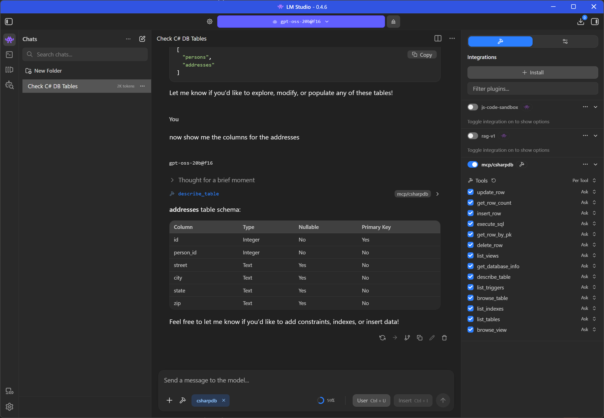

# MCP Server Reference

CSharpDB includes a [Model Context Protocol](https://modelcontextprotocol.io/) (MCP) server that lets AI assistants — Claude Desktop, OpenAI Desktop, Cursor, VS Code Copilot, and others — interact with a CSharpDB database through a standardized tool interface.

The server exposes 14 tools for schema inspection, data browsing, row mutations, and arbitrary SQL execution.

---

## Running the Server

```bash
# Default database (csharpdb.db in the current directory)
dotnet run --project src/CSharpDB.Mcp

# Specific database file
dotnet run --project src/CSharpDB.Mcp -- --database mydata.db
```

### Database Path Configuration

The database file is resolved in this order:

| Priority | Source | Example |
|----------|--------|---------|
| 1 | CLI argument | `--database mydata.db` or `-d mydata.db` |
| 2 | Environment variable | `CSHARPDB_DATABASE=mydata.db` |
| 3 | `appsettings.json` | `ConnectionStrings:CSharpDB` |
| 4 | Default | `csharpdb.db` |

---

## Client Configuration

### Claude Desktop

Add to `claude_desktop_config.json`:

```json
{
  "mcpServers": {
    "csharpdb": {
      "command": "dotnet",
      "args": ["run", "--project", "/path/to/src/CSharpDB.Mcp", "--", "--database", "/path/to/mydata.db"]
    }
  }
}
```

### Claude Code

Add to `.mcp.json` in your project root:

```json
{
  "mcpServers": {
    "csharpdb": {
      "command": "dotnet",
      "args": ["run", "--project", "/path/to/src/CSharpDB.Mcp", "--", "--database", "/path/to/mydata.db"]
    }
  }
}
```

### Cursor / VS Code

Add to your MCP settings (typically `.cursor/mcp.json` or VS Code settings):

```json
{
  "mcpServers": {
    "csharpdb": {
      "command": "dotnet",
      "args": ["run", "--project", "/path/to/src/CSharpDB.Mcp", "--", "--database", "/path/to/mydata.db"]
    }
  }
}
```

### OpenAI Codex CLI

Add to your [Codex config](https://developers.openai.com/codex/mcp/) (`~/.codex/config.toml` globally, or `.codex/config.toml` per-project):

```toml
[mcp_servers.csharpdb]
command = "dotnet"
args = ["run", "--project", "/path/to/src/CSharpDB.Mcp", "--", "--database", "/path/to/mydata.db"]
```

### ChatGPT Desktop

ChatGPT Desktop currently only supports [remote MCP servers over HTTPS](https://developers.openai.com/apps-sdk/deploy/connect-chatgpt/) — it cannot spawn local stdio processes. To connect CSharpDB:

1. Run the MCP server with an HTTP-to-stdio bridge such as [supergateway](https://github.com/nicholasgasior/supergateway) or [mcp-proxy](https://github.com/nicholasgasior/mcp-proxy):
   ```bash
   npx supergateway --port 8080 -- dotnet run --project /path/to/src/CSharpDB.Mcp -- --database /path/to/mydata.db
   ```
2. Expose the local port via [ngrok](https://ngrok.com/) or similar:
   ```bash
   ngrok http 8080
   ```
3. In ChatGPT, go to **Settings → Connectors → Create** and paste the public HTTPS URL.

> **Tip:** If you only need SQL access from ChatGPT, the [REST API](rest-api.md) at `http://localhost:61818` may be simpler — no bridge required.

### LM Studio

LM Studio supports MCP servers starting from [v0.3.17](https://lmstudio.ai/blog/lmstudio-v0.3.17). Open the **Program** tab in the right-hand sidebar, click **Install → Edit mcp.json**, and add CSharpDB:

```json
{
  "mcpServers": {
    "csharpdb": {
      "command": "dotnet",
      "args": ["run", "--project", "/path/to/src/CSharpDB.Mcp", "--", "--database", "/path/to/mydata.db"]
    }
  }
}
```

The `mcp.json` file lives at:

| OS | Path |
|----|------|
| Windows | `%USERPROFILE%\.lmstudio\mcp.json` |
| macOS / Linux | `~/.lmstudio/mcp.json` |

> **Note:** For all stdio-based clients (Claude, Codex, Cursor, LM Studio), make sure `dotnet` is available on your system PATH.



---

## Available Tools

### Schema Tools

| Tool | Description | Parameters |
|------|-------------|------------|
| `GetDatabaseInfo` | Get the database file path | — |
| `ListTables` | List all table names | — |
| `DescribeTable` | Get column names, types, and constraints | `tableName` |
| `ListIndexes` | List all indexes with table, columns, uniqueness | — |
| `ListViews` | List all views with their SQL definitions | — |
| `ListTriggers` | List all triggers with timing, event, and body | — |

### Data Tools

| Tool | Description | Parameters |
|------|-------------|------------|
| `BrowseTable` | Paginated row browsing with schema | `tableName`, `page?` (default 1), `pageSize?` (default 50) |
| `BrowseView` | Paginated view result browsing | `viewName`, `page?` (default 1), `pageSize?` (default 50) |
| `GetRowByPk` | Fetch a single row by primary key | `tableName`, `pkColumn`, `pkValue` |
| `GetRowCount` | Get total row count for a table | `tableName` |

### Mutation Tools

| Tool | Description | Parameters |
|------|-------------|------------|
| `InsertRow` | Insert a row into a table | `tableName`, `valuesJson` |
| `UpdateRow` | Update a row by primary key | `tableName`, `pkColumn`, `pkValue`, `valuesJson` |
| `DeleteRow` | Delete a row by primary key | `tableName`, `pkColumn`, `pkValue` |

The `valuesJson` parameter accepts a JSON object string with column names as keys:

```json
{"name": "Alice", "age": 30, "email": "alice@example.com"}
```

Values are automatically coerced to CSharpDB types: integers become `INTEGER`, decimals become `REAL`, strings become `TEXT`, null stays `NULL`.

`DescribeTable` and `BrowseTable` include `isIdentity` metadata for identity columns.

### SQL Tool

| Tool | Description | Parameters |
|------|-------------|------------|
| `ExecuteSql` | Execute any SQL statement | `sql` |

This is the general-purpose tool for anything not covered by the specialized tools — DDL (`CREATE TABLE`, `ALTER TABLE`, `DROP`), complex queries with JOINs and aggregates, `CREATE INDEX`, `CREATE VIEW`, `CREATE TRIGGER`, and so on.

---

## Example Conversations

Once connected, an AI assistant can interact with CSharpDB naturally:

> **User:** What tables are in the database?
>
> **Assistant:** *(calls ListTables)* The database has 7 tables: customers, categories, products, orders, order_items, reviews, and shipping_addresses.

> **User:** Show me the top 5 customers by order total.
>
> **Assistant:** *(calls ExecuteSql with a JOIN + GROUP BY query)* Here are the top 5 customers...

> **User:** Add a new product called "Widget Pro" priced at $29.99 in category 2.
>
> **Assistant:** *(calls InsertRow)* Done — inserted 1 row into the products table.

---

## Architecture

The MCP server is a .NET console app using stdio transport:

```
AI Client (Claude, Cursor, etc.)
    │
    │  stdio (JSON-RPC)
    │
CSharpDB.Mcp (Generic Host)
    │
CSharpDbService (thread-safe singleton)
    │
CSharpDbConnection (ADO.NET)
    │
CSharpDB Engine (B+tree, WAL, Pager)
    │
mydata.db
```

All 14 tools are thin wrappers around `CSharpDbService`, which handles connection management, locking, and SQL execution. The MCP SDK (`ModelContextProtocol` NuGet package) handles protocol framing, tool discovery, and transport.

---

## See Also

- [Getting Started Tutorial](getting-started.md) — Learn the CSharpDB API step by step
- [REST API Reference](rest-api.md) — HTTP endpoints for the same operations
- [CLI Reference](cli.md) — Interactive REPL for manual exploration
