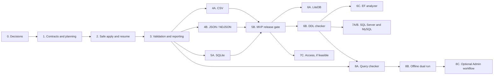

# Migration Tooling Execution Phases

Internal working roadmap derived from the Migration Tooling Research and
Delivery Plan dated July 20, 2026. The research plan remains the source for
technical detail; this document turns its five large milestones into phases
that can be planned, implemented, reviewed, and closed independently.

## How To Use This Roadmap

- Treat each phase as an epic with its own exit gate, not as a collection of
  code that can be declared complete without end-to-end proof.
- Keep `inspect -> plan -> preview -> apply -> resume -> validate -> report` as
  the product spine. Each phase should extend that spine rather than create a
  separate one-off tool.
- Complete the foundation in order. After Phase 3, use the stated parallel
  tracks without changing shared artifact formats casually.
- Ship fixtures, tests, diagnostics, documentation, and capability claims with
  the feature that needs them. Do not defer assurance work to a final hardening
  phase.
- Keep production dual writes, CDC, zero-downtime cutover, broad automatic SQL
  translation, and arbitrary document flattening outside this roadmap.

## Roadmap At A Glance

| Phase | Outcome | Required predecessor | Original delivery group |
| --- | --- | --- | --- |
| 0. Decisions and feasibility | Product boundaries, dependency choices, fixtures, and the Access decision are known. | None | Milestone 0 |
| 1. Contracts and planning slice | A synthetic source can be inspected, planned, and previewed through versioned artifacts. | Phase 0 | Milestone 0 |
| 2. Safe apply and resume | A staged target can be loaded and resumed after faults without missing or duplicate rows. | Phase 1 | Milestone 0 |
| 3. Validation and reporting | Schema, count, and strong content validation gate target activation. | Phases 1-2 | Milestone 0 |
| 4. Streaming file migration | CSV and JSON/NDJSON can be imported and exported safely at large scale. | Phases 1-3 | Milestone 1 |
| 5. SQLite and MVP release | CSV, JSON/NDJSON, and SQLite form the first supported migration release. | Implementation: Phase 3; MVP release: Phase 4 | Milestone 1 |
| 6. Embedded and developer tooling | LiteDB import, DDL checking, and EF migration analysis are supported. | Stable Phases 1-3; scheduled after the MVP | Milestone 2 |
| 7. Server and legacy readiness | SQL Server/MySQL readiness reports and optional Access import are available. | Core schema/type contracts; DDL proof pipeline; Access spike | Milestone 3 |
| 8. Query and cutover assurance | Static query evidence and offline read-only differential validation are available. | DDL checker, canonical codec, spill infrastructure, and the adapter(s) used by each query pack | Milestones 3-4 |

The estimates in the research plan remain the planning baseline:

| Delivery group | Phases | Estimate |
| --- | --- | ---: |
| Foundation | 0-3 | 5-8 person-weeks |
| Trusted-adoption MVP | 4-5 | 12-18 person-weeks |
| Embedded and developer tooling | 6 | 11-17 person-weeks |
| Server and legacy readiness, including static query work | 7 and 8A | 14-22 person-weeks |
| Cutover assurance | 8B and optional Admin work | 6-10 person-weeks |

These are aggregate ranges, not commitments for each subphase. Re-estimate
after Phase 3 using measured target throughput, checksum spill cost, and the
result of the Access spike.



Dual-run support is qualified per source provider. A query pack requires only
the adapters it actually uses; LiteDB, Access, SQL Server, and MySQL are not
global prerequisites for the dual-run framework.

## Repository Alignment

The current codebase supports this ordering and imposes several useful
boundaries:

| Existing seam | Use in this roadmap | Constraint to preserve |
| --- | --- | --- |
| [`CSharpDB.Cli`](../src/CSharpDB.Cli/Program.cs) | Add an independent `MigrationCommandRunner`, matching the existing command-runner dispatch. | Do not bury migration orchestration inside the interactive shell. |
| [`InsertBatch`](../src/CSharpDB.Engine/InsertBatch.cs) | Use as the first typed, transactional, local staged-target writer. | `ICSharpDbClient` has no remote prepared-batch surface yet, so remote bulk migration is not part of the first target implementation. |
| [`CSharpDB.Pipelines`](../src/CSharpDB.Pipelines/Runtime/PipelineOrchestrator.cs) | Reuse useful checkpoint, reject, metrics, and history concepts through adapters. | Current batches commit before checkpoint persistence; CSV reads physical lines; JSON paths buffer whole inputs/outputs. These cannot be treated as migration-grade unchanged. |
| [`CSharpDB.DevOps`](../src/CSharpDB.DevOps/DataComparisonService.cs) | Reuse presentation and target-catalog ideas where appropriate. | Its schema model is CSharpDB-specific, data comparison materializes both sides, public summaries use `int`, and some numeric normalization passes through `double`. It is not the source-neutral migration IR or strong streaming validator. |
| [`CSharpDB.ImportExport`](../src/CSharpDB.ImportExport/TableArchives/TableArchiveReader.cs) and [Admin restore](../src/CSharpDB.Admin.ImportExport/Services/TableImportExportService.cs) | Archive restore is the independent Phase 2 safety workstream. | Archive v5 separates logical secondary-index metadata from its bounded physical lookup index; safe restore activation requires a direct/local transaction snapshot capability. |
| [`CSharpDB.EntityFrameworkCore`](../src/CSharpDB.EntityFrameworkCore/Storage/Internal/CSharpDbTypeMappingSource.cs) | Reuse the provider's validator, mappings, SQL generator, and execution tests. | Exact decimal/date/identifier storage rules should move to a shared codec before migration adapters duplicate them. |
| Existing count surfaces | Retain engine/archive `long` counts and introduce 64-bit migration contracts. | Several public client, browse, and diff surfaces currently use `int`; validation must not inherit those limits. |

The first target is therefore a local staged CSharpDB file using typed engine
batches. Provider packages, remote migration, and UI wrapping come only after
the local contracts are proven.

## Phase 0: Decisions And Feasibility

**Goal:** lock the product boundaries and retire the largest unknowns before
public contracts harden.

**Status:** complete for the portable foundation. Access is a conditional,
non-blocking track with explicit native qualification gates.

### Work

- [x] Accept or explicitly change the eight product decisions from the
  research plan:
  - one migration suite and one versioned plan format;
  - CSV, JSON/NDJSON, and SQLite as the first public MVP;
  - preserve-first type mapping with diagnostic-specific lossy overrides;
  - collection-to-collection LiteDB mapping by default;
  - Access in an optional Windows package/process;
  - MySqlConnector and optional ScriptDom as the initial provider choices;
  - no production dual writes, CDC, or zero-downtime promise;
  - capability rules embedded with the matching product binary.
- [x] Record short architecture decisions for package boundaries, artifact
  versioning, staged-target activation, and CLI-first delivery.
- [x] Approve or reject CsvHelper after dependency, license, and behavior
  review.
- [x] Time-box the Access/ACE feasibility spike across `.mdb`, `.accdb`, x64,
  x86, installed Office/ACE combinations, read-only access, and fixture/CI
  constraints.
- [x] Inventory the native archive-restore fidelity gaps that must be repaired
  before archives can serve as a safety net.
- [x] Choose supported source versions and define the legal fixture strategy
  for the MVP and later provider packages.
- [x] Turn the release gates into a tracked test matrix.

### Deliverables

- Decision records and initial package dependency diagram.
- Supported-version and fixture matrix.
- Dependency/licensing decisions.
- Access go, conditional-go, or defer report.
- Prioritized backlog for Phases 1-3.

### Exit Gate

All eight product defaults are accepted or replaced explicitly, portable MVP
dependencies and fixtures are approved, and Access has a packaging direction
or a documented deferral. Access must not block portable foundation work.

## Phase 1: Versioned Contracts And Planning Vertical Slice

**Goal:** establish the shared language used by every source adapter,
executor, validator, analyzer, and report.

**Status:** complete for the in-repository planning vertical slice. The Phase 1
exit gate is covered by deterministic artifact, planner, CLI, secret-scanning,
naming, capability, mapping-policy, and shared-codec tests. NuGet publication
remains intentionally disabled pending a separate wire-contract and SDK
API-freeze review.

### Work

- [x] Add `CSharpDB.Migration` and `CSharpDB.Migration.Tests` to the solution.
- [x] Define versioned `MigrationCatalog`, `MigrationPlan`, diagnostic, source
  identity/fingerprint, consistency, mapping, and validation models.
- [x] Preserve source-native facets and unsupported objects rather than
  coercing the catalog directly into `TableSchema`.
- [x] Define compatibility states and the five-level evidence ladder.
- [x] Define the core inspector, data source, type mapper, target, snapshot,
  and validator interfaces. Implementations belong in later phases.
- [x] Implement `preserve`, `queryable`, and `custom` mapping policies with
  `Exact`, `LosslessReencoded`, `Lossy`, and `Unsupported` results.
- [x] Record the coverage behind every sample- or profile-derived mapping and
  require the planned mapping to be checked against every value during apply.
- [x] Extract or share exact decimal, date/time, GUID, and identifier codecs so
  EF and migration paths cannot drift.
- [x] Add deterministic name mapping.
- [x] Add deterministic artifact serialization, schema versions, catalog-bound
  plan digests, duplicate/unknown-property rejection, and defense-in-depth
  secret checks.
- [x] Embed a version-matched CSharpDB capability catalog and bind every plan
  to its digest.
- [x] Build a deliberately awkward synthetic source containing supported,
  rewritten, lossy, unsupported, and dependency-sensitive objects.
- [x] Add a `MigrationCommandRunner` to the existing CLI dispatch pattern and
  implement `inspect`, `plan`, and `preview` for the synthetic source.

### Deliverables

- Core migration project and test project; NuGet publication deferred pending
  API freeze.
- Versioned JSON artifact formats and golden fixtures.
- Stable diagnostic identifiers and text/JSON preview output.
- Synthetic planning vertical slice.

### Exit Gate

The synthetic source retains both representable and unsupported facets; its
catalog and plan round-trip deterministically; every proposed type conversion
is classified; lossy choices require a named diagnostic override; and no
artifact contains a credential or raw secret.

## Phase 2: Safe Staged Apply And Crash-Proof Resume

**Goal:** prove that data can be written efficiently and resumed after a crash
without corruption.

**Status:** complete for the synthetic staged target and direct/local archive
restore. The `apply --resume` vertical slice now has a versioned deterministic
fail-fast contract, bounded prepared
batches, transactional row-and-receipt commits, identity and digest
verification, safe existing-target refusal, staged lifecycle/run reports, and
true child-process kill/restart coverage at every commit boundary. The real
file-backed target has also been qualified at 100,000 and 1,000,000 rows with a
fixed live-batch bound.

Archive format v5 now separates logical secondary indexes from the archive's
physical lookup index and restores ordered keys, checks, foreign keys,
collations, defaults, renamed self-references, rowversion exclusions, and the
persisted `NextRowId`. Every new archive carries required SHA-256 digests for
its schema, rows, and optional physical index, and every reader path verifies
them before serving data. Physical PK-index construction retains at most
65,536 entries and writes a complete scan-only archive above that bound.

Restore now uses a deterministic, journal-owned staging table, validates its
64-bit count and normalized schema, and atomically activates it by rename.
Caught failures clean up immediately; a new process can safely reclaim an
expired, ownership-matched staging lease without touching an unrelated table.
Before activation, restore now also compares the integrity-checked archive rows
with the staged rows through the frozen `csharpdb-canon-v1` contract. The
duplicate-preserving, order-independent comparison uses the Phase 3 bounded
partition/spill validator, excludes regenerated rowversion values, and performs
its schema recheck, forward-only target scan, and activation in one transaction.
The archive is first copied from one locked source handle to an immutable
private snapshot, so metadata, rows, and the activation token cannot come from
different file versions. Same-count row corruption, archive replacement,
schema races, multi-page unkeyed duplicates, cleanup, retry, and rowversion
regeneration are covered by integration tests. A durable activation receipt in
the rename transaction resolves a lost commit acknowledgment. Snapshot and
validation-spill usage have independently configurable 4-GiB default limits. Remote restore remains
unsupported until its transport can provide the same transaction-bound schema
and cursor capability.

### Work

- [x] Implement the CSharpDB migration target over prepared insert batches,
  including BLOB values, schema creation, cancellation, and bounded memory.
- [x] Create a new staged database by default and record a stable target
  identifier.
- [x] Apply schema in stages: load-essential objects, data, secondary indexes,
  constraints, views, and triggers.
- [x] Store each batch receipt in the same target transaction as its rows, or
  prove an equivalent stable-key idempotency contract.
- [x] Make resume verify the plan digest, source fingerprint, source
  snapshot/watermark, target identifier, and completed batch digests.
- [x] Refuse an existing target unless the plan names an explicit and
  recoverable merge/replace policy.
- [x] Define deterministic reject and cancellation behavior. Phase 2 supports
  the versioned fail-fast contract; the durable skip-and-record transaction
  and ledger are now implemented, while normal execution remains rejected
  before target creation until source replay and qualification are complete.
- [x] Validate every streamed value against the planned mapping; block or
  deterministically reject values that contradict profile-derived assumptions
  rather than coercing them silently.
- [x] Repair the archive-restore fidelity gaps identified in Phase 0.
  - [x] Add v5 logical secondary-index metadata while preserving v3/v4 reads.
  - [x] Enforce strict rows, bounded/canonical sections, atomic path writes,
    exact identity reseeding, staged activation, cleanup, and count validation.
  - [x] Add required archive integrity digests and post-load normalized-schema
    validation.
  - [x] Replace the O(N) physical PK-index build with a documented bounded
    no-index mode, and make staging cleanup crash-resumable through a durable
    ownership journal.
  - [x] Validate the post-load canonical row hash after Phase 3 defines and
    freezes `csharpdb-canon-v1`.
- [x] Add fault injection immediately before, during, and after target commit
  and receipt persistence.
- [x] Measure prepared-batch throughput and memory before adapter work relies
  on the implementation; see
  [`migration-tooling-phase-2-performance.md`](migration-tooling-phase-2-performance.md).

### Deliverables

- `apply --resume` synthetic vertical slice.
- Transactional receipt schema and resume contract.
- Staged-target lifecycle and failure report.
- Archive fidelity fixes and regression coverage.

### Exit Gate

Injected faults at every commit boundary produce neither missing nor duplicate
rows; every resume rejects changed identities or digests; writes use bounded
memory; existing targets are protected by default; and an interrupted target
cannot be activated. A golden archive round trip must also prove restoration of
every constraint and secondary index represented by the archive format before
archives are described as a complete safety net.

The staged migration target and native archive restore both satisfy this gate.
Archive v5 has golden constraint/index restoration, required section-digest
validation, a bounded physical-index policy, durable abandoned-staging
recovery, and transactional post-load canonical row validation before rename.

## Phase 3: Validation And Reporting Core

**Goal:** make correctness, rather than copy completion, the definition of a
successful migration.

**Status:** complete for the synthetic/local CSharpDB foundation slice. The
canonical codec now has normative vectors for every v1 tag; validation uses
normalized actual-target schema, coherent 64-bit counts, and bounded
duplicate-preserving partitioned hashes; deterministic reports are secret-
scanned and semantically verified; and a published `Passed` report plus an
exclusive target writer barrier are enforced before atomic activation.

### Work

- [x] Specify `csharpdb-canon-v1` with contract hashes, type tags, null
  markers, lengths, and canonical logical payloads.
- [x] Publish cross-platform golden vectors for integers, decimals, reals,
  text, BLOBs, date/time values, nulls, and exclusions.
- [x] Implement normalized schema validation and snapshot-consistent 64-bit
  row/document counts.
- [x] Implement partitioned SHA-256 validation with deterministic spill/sort,
  duplicate preservation, and mismatch drill-down.
- [x] Make count and checksum validation use one coherent source view; return
  `Inconclusive` when that cannot be established.
- [x] Generate reproducible text and JSON reports tied to plan, source, target,
  and canonicalization versions.
- [x] Persist the final digested report after validation and prevent
  staged-target activation until both the selected validation level passes and
  that audit artifact is written successfully.
- [x] Add deliberate corruption, duplicate, concurrent-write, cancellation,
  temporary-disk cleanup, and large-data tests.

### Deliverables

- `validate` CLI path.
- Canonical codec and hash-vector specification.
- Schema, count, checksum, and mismatch-detail validators.
- Activation gate and validation reports.

### Exit Gate

Large synthetic migrations validate with bounded memory; deliberate
differences localize to a partition or keyed row where possible; duplicate
counts are preserved; unavailable consistency produces `Inconclusive`; and no
migration can report success before its required validation passes and its
final digested report is durably written.

The complete foundation gate is this executable scenario:

```text
synthetic inspect
  -> plan
  -> preview
  -> staged apply
  -> injected crash
  -> resume
  -> schema/count/checksum validate
  -> deterministic report
```

The same test must reject plan, source, snapshot, and target digest mismatches
and prove that no serialized artifact contains a secret.

The executable foundation spine is covered by a real child-process
crash/resume test that continues through checksum validation, exact report
retry, and activation. Focused adversarial coverage rejects changed bindings,
unexpected target objects, changing or unavailable source views, a second
target writer, contradictory/tampered/oversized reports, duplicate keys, spill
exhaustion, and cancellation. The 50,000-row qualification case uses a 64 KiB
sort cap and an eight-writer partition cap, completes with exact checksums, and
leaves no spill workspace. Migration tests now run on Windows, Linux, and
macOS in CI.

## Phase 4: Streaming File Migration

**Goal:** deliver production-quality CSV and JSON/NDJSON import and export.
The two adapter tracks can proceed in parallel after the Phase 1-3 contracts
are stable.

**Status:** in progress. The isolated `CSharpDB.Migration.Files` package now
contains the strict Phase 4A CSV reader plus immutable raw-byte snapshots,
bounded delimiter/BOM inspection with explicit ambiguity, and deterministic
content/format source binding. It now also provides bounded confidence-bearing
schema inference, explicit ordinal overrides, and validated migration catalogs.
Strict full-stream migration-source adaptation now validates the entire
projected stream, preserves projection order, bounds batches by rows and
canonical bytes, and supplies deterministic snapshot/policy-bound cursors.
Inspection and a later process can now cross a durable boundary through an
atomically published, canonical, tamper-evident `.csdbcsv` package that embeds
the raw snapshot and replays its exact reader, inference, and catalog policy.
The CLI now inspects raw CSV into that package plus the standard catalog, emits
an independently retainable manifest digest, and requires the exact package
pin for apply, resume, and validation before target mutation. Retained CSV now
also exposes deterministic skip-and-record rejects through an explicit
plan-bound rule/limit policy and a required operator-owned artifact. The typed
`csharpdb-csv-export-manifest/v1` sidecar contract now binds the source
snapshot, deterministic row order, ordered CSharpDB types, fixed lossless CSV
codec, BLOB decoded-size bounds, physical data digest, and source/export
logical digests. Its separately named spreadsheet-safe profile records
explicit aggregate loss. The streaming RFC 4180 writer now emits deterministic
typed rows and canonical physical and logical manifest evidence to a
caller-owned empty stream. It supports lossless and explicitly lossy
spreadsheet-safe output with bounded UTF-8 and BLOB chunks, but is deliberately
restart-only. The canonical `csharpdb-csv-export-checkpoint/v1` serializer now
binds the retained source identity, schema, profile, codec and resource policy
to a complete-record byte boundary, signed last row ID, physical prefix digest,
logical row-hash prefix digests, transform counts, and optional data-complete
manifest evidence. Zero-row progress is exact rendered-header evidence.
Prefix digests are verification-only rather than resumable SHA-256 state. A
Windows-qualified prepared-output lease for local filesystems now derives
private data, active checkpoint, and pending checkpoint siblings solely from
the normalized future destination while failing closed if that final path
exists. Its owner-only exclusive prepared handle is the cross-process lease.
It bounds active checkpoint reads, requires explicit reset of uncheckpointed
data, verifies the checkpoint binding plus the exact prepared-prefix digest
and CRLF boundary before tail truncation, preserves files on disposal, and
never treats stale pending bytes as authority. Generations start at zero,
advance by exactly one, permit only exact-byte idempotence, enforce monotonic
row/byte/evidence progress, and make `DataComplete` terminal. Persistence
orders durable prepared data carrying exact prefix-hash evidence before a
durable exact pending checkpoint and handle-based atomic active replacement.
The generic stateful prepared-output coordinator now writes the exact header as
generation zero, emits periodic complete-row checkpoints, and recovers by
replaying the immutable row source through the checkpoint boundary with the
same renderer. Recovery rebuilds and verifies both logical prefixes and
transform counters, independently rehashes the prepared physical prefix before
continuation, and relies on the lease to truncate a non-authoritative tail.
Reopening `DataComplete` replays through the final boundary, proves source EOF,
verifies the final logical digests, and reconstructs the manifest without
appending. The generic `OpenRows` factory remains a trusted seam, while
`CSharpDbCsvExportAdapter` now closes the retained CSharpDB source-origin
boundary. It takes a retained path plus an independently pinned identity,
opens and owns one default-configured verified session, preflights the exact
physical table schema, and supplies sequential replay and exclusive-boundary
continuation readers from that same session. It derives source length,
SHA-256, and canonical snapshot identity from the verified session and binds
the normalized Engine reader informational version. The adapter exposes no
custom Engine or retained-snapshot options: the reader version and built-in
default reader/serializer composition define the source interpretation, while
custom provider provenance remains unsupported. The Windows publisher now
requires an independently pinned terminal manifest digest, requalifies the
private `DataComplete` journal and prepared bytes, copies into owner-private
pair-bound staging files, and performs atomic no-overwrite data-first,
manifest-last renames. It holds exact existing finals stable, reuses only an
exact CSV-only or exact-pair state, rejects manifest-only and every different
or unsafe final without mutation, stops observing cancellation after the
first irreversible final-data commit, and preserves the private journal for
recovery. The generic and retained CSharpDB end-to-end entry points replay the
bound source through EOF before publication. Abrupt-power-loss qualification
of namespace replacement remains incomplete. Automated child `Process.Kill`
coverage qualifies process-crash recovery but does not close the external
hard-power gate; see
[`migration-csv-export-power-loss-qualification.md`](migration-csv-export-power-loss-qualification.md).
The CLI now exports one physical
table from an already retained snapshot with an independently pinned canonical
snapshot identity. It publishes an explicit sibling CSV/manifest pair and
uses an exact rerun of the same command as its verified resume and idempotent
recovery path. It exposes lossless and explicitly lossy spreadsheet-safe
profiles, resource-bound overrides, safe text or JSON results, and per-artifact
reuse flags.
Non-Windows platforms remain unsupported, and UNC or mapped network volumes
fail closed. The offline retained read-only CSharpDB snapshot can be reopened
and verified across
processes, and its physical table reader provides strictly ascending signed
row IDs plus an exclusive resume boundary. See
[`migration-csharpdb-retained-snapshot.md`](migration-csharpdb-retained-snapshot.md).
Retained CSV has a 50,000-row CI fixture plus isolated 100K/1M inspect, package,
replay, apply,
resume, and checksum measurements with fixed live-batch bounds; see
[`migration-csv-reader-foundation.md`](migration-csv-reader-foundation.md),
[`migration-csv-inspection-and-source-binding.md`](migration-csv-inspection-and-source-binding.md),
[`migration-csv-schema-inference.md`](migration-csv-schema-inference.md),
[`migration-csv-data-source.md`](migration-csv-data-source.md),
[`migration-csv-retained-package.md`](migration-csv-retained-package.md),
[`migration-csv-performance.md`](migration-csv-performance.md), and
[`migration-csv-export-contract.md`](migration-csv-export-contract.md). The
provider-neutral ordered outcome, reject-set digest, and v2 batch/receipt
foundation is frozen in
[`migration-deterministic-reject-contract.md`](migration-deterministic-reject-contract.md),
and the plan-bound rule/limit policy plus CSharpDB's atomic target ledger are
now implemented. Target reopen and validation-snapshot creation verify the
ledger against receipts, reapply plan-bound sensitive/artifact budgets, verify
contiguous terminal batch chains, and bind an outcome digest into the snapshot
identity. New activations require that identity while legacy activated targets
remain reopenable.
Capability-qualified SDK apply and validation now support reject-aware source
replay, CSV evidence, and exact snapshot-scoped receipt/ledger comparison.
Bounded SDK reject-artifact materialization now uses canonical JSONL, private
same-directory claims, atomic no-overwrite publication, exact-existing reuse,
and fresh-process recovery at partial-temp and post-publication boundaries.
The CLI preserves strict fail-fast as the default. Deterministic planning is
CSV-only and requires `--reject-mode deterministic`, the exact
`--reject-rules all|<id,...>` registry, and explicit per-batch/per-run rejected
row, evidence-value, evidence-batch, evidence-run, and artifact byte limits.
Apply, resume, and validation each require
`--allow-deterministic-rejects` and
`--reject-artifact <absolute-normalized-rejects.jsonl>`. Apply qualifies the
artifact before its success report; validation publishes its report,
requalifies the artifact against that target snapshot, and only then activates.
Reports expose safe aggregates and return a warning when rejects occurred. The
sensitive artifact remains operator-retained, while the target ledger and
receipts remain the resume authority.

### Track 4A: CSV

- [x] Isolate CsvHelper 33.1.0 in `CSharpDB.Migration.Files` and expose only
  adapter-owned public contracts.
- [x] Add a strict bounded logical-record reader with multiline/escaped quote,
  CRLF/LF/CR, strict BOM/encoding, header, explicit delimiter, exact
  culture-looking text, and null/empty/missing/trailing-empty coverage.
- [x] Add stable value-free parser diagnostics, forward-only/cancellation
  coverage, hostile field/record/column limit tests, and CI integration.
- [x] Freeze the complete raw source into a bounded private snapshot and bind a
  full-byte SHA-256 identity independently of the inspection window.
- [x] Add quote-aware bounded delimiter/BOM inspection with confidence,
  ambiguity, explicit selection, and culture/candidate-order invariance.
- [x] Bind normalized parsing semantics and exact culture policy into the CSV
  source fingerprint so later readers cannot drift from inspection.
- [x] Add bounded confidence-bearing schema inference, exact value-free
  evidence, ordinal overrides, conservative `Text` fallback, honest
  sample/full coverage, and validated migration catalogs.
- [x] Adapt the immutable schema-bound snapshot to `IMigrationDataSource` with
  full-stream scalar validation, strict missing/null behavior, arbitrary
  projection order, row/byte-bounded batches, replay, and opaque resume
  cursors.
- [x] Add an atomic single-file retained snapshot package with canonical
  manifests, strict/tamper-aware reopen, trusted digest pinning, copy-on-open
  ownership, and cross-process schema/catalog/cursor replay.
- [x] Wire CLI inspect, plan, apply, resume, and validation across the retained
  package boundary with an external manifest pin and pre-target catalog/source
  verification.
- [x] Add absolute parser/inference/package resource ceilings, a 50,000-row
  structural CI fixture, and isolated 100K/1M retained migration performance,
  resume, checksum, memory, and temporary-disk qualification.
- [x] Freeze the bounded provider-neutral reject record, canonical reject-set
  digest, one-outcome-per-source-row validator, and v2 batch/receipt binding
  while retaining the fail-fast execution gate.
- [x] Persist accepted rows, canonical reject ledger entries, and the v2
  receipt in one CSharpDB target transaction, with accepted-only, mixed,
  all-reject, rollback, replay, canonical-codec, tamper, and plan-limit tests.
- [x] Verify target-owned receipt/ledger chains and physical accepted counts
  before validation, and bind their canonical outcome digest into the target
  snapshot and activation receipt.
- [x] Serialize target mutation admission; enforce predecessor cursors,
  cross-batch source ordinals, terminal cursors, all-evidence privacy budgets,
  and exact canonical artifact-byte limits before commit and again on reopen.
- [x] Qualify accepted-only, mixed, and all-reject target batches in fresh
  processes at every row/ledger/receipt/commit boundary, then prove exact
  replay and a second fresh reopen without duplicated outcomes.
- [x] Add reject-aware source replay and compare its accepted/rejected outcome
  chain with snapshot-scoped target receipts and the canonical ledger before
  report publication or activation.

- [x] Replace physical-line parsing with an RFC 4180-capable streaming parser.
- [x] Support quoted multiline fields, escaped quotes, explicit/detected
  delimiters, encoding/BOM, headers, newline, culture, quote, and null policy.
- [x] Keep null, empty string, missing field, and an empty final column
  distinct.
- [x] Add bounded SDK reject-artifact materialization with exact canonical
  bytes, tamper/privacy/limit/cancellation coverage, exclusive publication,
  exact regeneration, and fresh-process recovery.
- [x] Expose CLI strict/tolerant modes with deterministic physical-line,
  logical-row, column, raw-value, and diagnostic information in a bounded
  operator-facing reject artifact.
- [x] Add confidence-bearing schema inference and explicit overrides; default
  ambiguous columns to `Text`.
- [x] Add restart-only streaming RFC 4180 export using the frozen typed
  manifest contract, with deterministic physical/logical evidence, bounded
  scalar emission, and spreadsheet-safe export as an explicitly lossy mode.
- [x] Freeze a canonical checkpoint contract for immutable export bindings,
  signed record-boundary row IDs, exact physical and logical prefixes, strict
  zero-row header evidence, transform counts, and data-complete manifest
  reconstruction. Prefix digests are verification evidence, not resumable hash
  state.
- [x] Add a Windows-qualified prepared-output lease and journal for local
  filesystems with destination-only deterministic private siblings, a
  current-owner-only exclusive prepared handle, fail-closed final-path
  admission, explicit uncheckpointed reset, bounded active-checkpoint reads,
  qualified binding/prefix/CRLF recovery, strict generation transitions,
  durable data-before-checkpoint ordering, atomic active replacement,
  non-authoritative stale pending files, and disposal that preserves all
  private files.
- [x] Add the generic stateful resumable prepared-output coordinator with exact
  header generation zero, periodic complete-row checkpoints, replay through
  the signed row boundary using the fixed renderer, logical-prefix and
  transform-count rebuild, independent physical-prefix rehash before append,
  lease-owned tail truncation, and `DataComplete` EOF proof and manifest
  reconstruction on reopen.
- [x] Bind the retained CSharpDB source adapter and source-origin proof from a
  path plus independently pinned `RetainedDatabaseSnapshotIdentity`: own one
  default-configured verified session, preflight and recheck the physical
  schema, derive all source evidence, and keep replay/continuation on that
  session. Bind the normalized Engine reader version and fixed built-in
  reader/serializer composition; custom provider provenance remains
  unsupported.
- [x] Implement fail-closed manifest-last publication with explicit sibling
  paths, independently pinned terminal manifest evidence, prepared-data
  requalification and copy, durable private staging, atomic no-overwrite
  renames, exact-existing recovery, invalid-state preservation, frozen
  post-data cancellation, and retained private recovery authority.
- [x] Add the retained-snapshot CSV export/resume CLI with an independently
  pinned canonical source identity, explicit sibling CSV and manifest paths,
  exact-command rerun recovery, profile and resource-limit controls, and text
  or JSON results with reuse flags.
- [ ] Qualify checkpoint and publication namespace replacement under abrupt
  power loss.
  Follow the
  [external hard-off qualification runbook](migration-csv-export-power-loss-qualification.md);
  process-kill tests remain process-crash coverage only. Because parent
  directory entries are not flushed and the current admission covers broad
  local-Windows filesystems, close this item only after every claimed
  filesystem/cache matrix cell passes or runtime support is narrowed to the
  qualified matrix.
  Prepared output remains unsupported on non-Windows platforms and fails
  closed on UNC or mapped network volumes.

### Track 4B: JSON And NDJSON

The strict
[`migration-json-reader-foundation.md`](migration-json-reader-foundation.md)
freezes UTF-8 framing, ordered logical values, exact number lexemes, recursive
duplicate detection, deterministic nested-value serialization, stable
diagnostics, and per-value resource ceilings. Immutable private snapshots now
bind the exact framing and reader limits used for replay. The
[`migration-json-table-schema.md`](migration-json-table-schema.md) contract
adds full-stream object-row shape discovery, first-encounter column ordering,
strict missing/null policy, bounded native-type evidence, preservation-first
number classification, and migration-catalog inspection. The
[`migration-json-data-source.md`](migration-json-data-source.md) contract now
adds catalog-bound object-row projection, full-stream projected-value
revalidation, deterministic row-local rejects, bounded batches, and exact
snapshot/policy-bound cursor replay. The
[`migration-json-retained-package.md`](migration-json-retained-package.md)
contract adds deterministic single-file publication, strict canonical
manifests, trusted digest pinning, copy-on-open ownership, semantic replay,
and tamper-aware reopen. The
[`migration-json-typed-intent.md`](migration-json-typed-intent.md) contract
adds a canonical source-bound sidecar for non-native scalar intent while
leaving package v1 unchanged. Typed schema/value integration, collection
projection, export, and CLI integration remain open.

- [x] Stream root arrays and NDJSON/multiple top-level values without loading
  the full input.
- [x] Preserve original names, explicit nulls, stable output order, duplicate
  key diagnostics, and unrepresentable number lexemes.
- [x] Keep nested values as versioned canonical JSON text for table targets.
- [x] Add an atomic retained JSON/NDJSON package with bounded canonical
  manifests, exact raw-byte identity, trusted digest pinning, copy-on-open
  ownership, schema/catalog replay, and fresh-process cursor resume.
- [ ] Keep nested values as documents for collection targets unless an
  explicit projection is selected.
- [x] Define a source-bound sidecar convention for BLOB, decimal, GUID,
  date/time, and other non-native JSON intent.
- [ ] Stream JSON array and NDJSON output without buffering all rows.

### Shared Deliverables

- CSV and JSON source/export adapters.
- Versioned sidecar/manifest formats.
- Round-trip, reject, resume, and large-stream fixtures.
- CLI help, examples, and performance measurements.

### Exit Gate

Multiline CSV, null/empty/missing distinctions, arbitrary-precision JSON
numbers, nested values, and typed sidecar data round-trip according to policy;
large files do not cause file-size-proportional memory growth; interrupted
loads resume correctly; and each fixture passes schema, count, and checksum
validation. Inference reports its coverage, and every loaded value is checked
against the planned mapping.

## Phase 5: SQLite And Trusted-Adoption MVP Release

**Goal:** complete the first supported end-to-end database migration story and
release the trusted-adoption MVP.

SQLite implementation may begin in parallel with Phase 4 after Phase 3 is
stable. The release gate joins all three MVP sources.

### Work

- [ ] Add `CSharpDB.Migration.Sqlite` with explicitly read-only source access.
- [ ] Inspect `sqlite_schema` and the required table, column, index, and foreign
  key PRAGMAs rather than relying on `DbConnection.GetSchema`.
- [ ] Support Tier 1 ordinary tables, columns, rowid/integer primary keys,
  unique constraints, foreign keys, basic indexes, and streaming rows.
- [ ] Profile actual storage-class distributions and diagnose mixed types or
  values that invalidate the planned mapping.
- [ ] Offer an explicit SQLite backup snapshot for a live source and record the
  consistency strategy.
- [ ] Inventory all Tier 2/3 objects and report them as conditional,
  unsupported, or unknown rather than silently omitting them.
- [ ] Polish CLI errors, progress, reports, packaging, examples, and
  source-version documentation across CSV, JSON/NDJSON, and SQLite.
- [ ] Run all first-release security, fault, resume, bounded-memory, and
  reproducibility gates.

### Deliverables

- SQLite Tier 1 source adapter.
- Supported-source and capability matrix.
- End-to-end fixtures and large-stream performance results.
- First supported migration release for CSV, JSON/NDJSON, and SQLite.

### Exit Gate

Every MVP fixture and representative large source completes the full
`inspect -> plan -> preview -> apply/resume -> validate -> report` workflow;
schema, count, and strong checksum checks pass; source access is proven
read-only; mixed SQLite storage classes are visible; memory remains bounded;
no unsupported source object disappears from the report; profiling coverage is
recorded; and every streamed value is checked against the planned mapping.

## Phase 6: Embedded And Developer Tooling

**Goal:** cover embedded document adoption and CSharpDB developer
compatibility. LiteDB and DDL work can run in parallel; EF work follows the
first working DDL proof path.

### Track 6A: LiteDB

- [ ] Add `CSharpDB.Migration.LiteDb` using untyped `BsonDocument` access.
- [ ] Map one source collection to one CSharpDB collection by default.
- [ ] Preserve BSON identity and types with deterministic tagged values.
- [ ] Translate only proven scalar-path indexes and diagnose every omission.
- [ ] Report field-presence and BSON-type distributions with analysis
  coverage. Leave relational projection for a later explicit policy.

### Track 6B: DDL Compatibility

- [ ] Add a CSharpDB-first parse, lower, capability, render, reparse, scratch
  apply, and catalog-compare proof pipeline.
- [ ] Preserve exact source spans and stable rule identifiers.
- [ ] Add only bounded source-dialect lowering after CSharpDB-ready scripts are
  proven. Never auto-apply generated rewrites.

### Track 6C: EF Core Migration Analysis

- [ ] Discover compiled migrations in a timed child process with an explicit
  application-code execution warning.
- [ ] Analyze `UpOperations`, `DownOperations`, annotations, destructive
  changes, generated provider SQL, and nested raw SQL.
- [ ] Run scratch prefix, down/up, and idempotence checks and attach failures to
  migration ID and operation index.

### Deliverables

- LiteDB collection importer.
- `csharpdb migrate ddl-check`.
- `dotnet csharpdb-ef analyze`.
- Capability matrices, fixtures, and proof reports for all three tracks.

### Exit Gate

LiteDB documents retain identity and logical types without implicit
flattening; unsupported indexes and features are explicit; DDL compatibility
claims include evidence beyond parse success; and supported EF migration chains
pass scratch execution while failures identify the exact operation and
remediation.

## Phase 7: Server And Legacy Readiness

**Goal:** provide trustworthy readiness reports for server databases and an
optional Access import path without promising broad server data migration.

The SQL Server, MySQL, and Access tracks can proceed largely in parallel.

### Track 7A: SQL Server Analyzer

- [ ] Add an optional package using `Microsoft.Data.SqlClient` and `sys.*`
  catalog views.
- [ ] Detect incomplete metadata visibility and record server version,
  edition, compatibility level, collation, and relevant options.
- [ ] Produce a complete inventory, dependency graph, deterministic mappings,
  supported-subset CSharpDB DDL preview, and explicit blockers.
- [ ] Use ScriptDom only in the optional package and only for bounded analysis.

### Track 7B: MySQL Analyzer

- [ ] Add an optional MySqlConnector package qualified for Oracle MySQL 8.0/8.4
  with InnoDB.
- [ ] Detect and leave MariaDB, Aurora, and other untested variants
  unqualified.
- [ ] Retain `SHOW CREATE TABLE` plus catalog, mode, charset/collation, time
  zone, case-sensitivity, type, generated-column, partition, and index facets.
- [ ] Inventory auto-increment and invisible columns, views, triggers, and
  routines even when they cannot be lowered to CSharpDB.
- [ ] Produce deterministic inventory, mappings, DDL preview, and diagnostics.

### Track 7C: Access Import

- [ ] Proceed only if Phase 0 established a supportable ACE/OLE DB direction.
- [ ] Isolate the adapter in an optional Windows package or helper process.
- [ ] Import local tables and common scalar schema/data; inventory saved
  queries for later checking and never execute forms, reports, macros, or VBA.
- [ ] Report linked, attachment, multivalued, calculated, and security features
  explicitly; keep credentials out of all durable artifacts.

### Deliverables

- Optional provider packages.
- Deterministic catalogs, mappings, dependency graphs, and DDL previews.
- Supported-version, permission, authentication, native-runtime, bitness,
  certificate, and licensing documentation.

### Exit Gate

Golden provider fixtures produce deterministic artifacts; analyzers prove
read-only behavior; incomplete permissions are detected; untested server
variants remain unqualified; the Access runtime/bitness matrix passes if that
track ships; every required MySQL object class is inventoried or remains
explicitly unsupported/unknown; and SQL Server/MySQL data import remains a
separately approved follow-on.

## Phase 8: Query Compatibility And Cutover Assurance

**Goal:** add evidence-based query portability and offline, read-only
differential validation without implying production replication safety.

### Track 8A: Static Query Compatibility

- [ ] Expose a public parse/bind/plan-only path or use a schema-faithful scratch
  database as a clearly labeled partial-evidence fallback.
- [ ] Parse the declared source dialect, identify vendor features, lower only
  proven mechanical rewrites, and bind against a supplied schema and typed
  parameter contract.
- [ ] Report nondeterminism, session state, side effects, temporary objects,
  and non-deterministic ordering as conditional or unknown.
- [ ] Keep parse acceptance, executable compatibility, and semantic
  equivalence as separate evidence levels.

### Track 8B: Offline Read-Only Dual Run

- [ ] Define typed query packs with source/target forms, parameters, result
  shape, ordering contract, comparison profile, volatility policy, timeout,
  and size limit.
- [ ] Compare ordered sequences, unordered multisets, and non-unique-order peer
  groups while preserving duplicates and null semantics.
- [ ] Reuse canonical logical values; require explicit floating tolerance and
  disable checksum-only matching when it is selected.
- [ ] Require a write freeze, immutable snapshot, or documented watermark;
  otherwise report `Inconclusive`.
- [ ] Stream or spill large results and clean temporary data reliably.

### Track 8C: Optional Admin Workflow

- [ ] Wrap the stable inspect, plan, preview, apply, resume, validate, and
  report contracts without creating Admin-only behavior.
- [ ] Keep the CLI and SDK as the authoritative automation surfaces.

### Deliverables

- `csharpdb migrate query-check`.
- Offline query-pack runner and versioned pack format.
- Reports that distinguish pass, difference, error, skipped, and
  inconclusive.
- Optional Admin workflow after the underlying contracts are stable.

### Exit Gate

Parse-only success is never reported as semantic compatibility; seeded query
differences are found; unordered comparisons retain duplicate counts; volatile
or snapshot-incoherent cases become `Inconclusive`; large results remain
bounded-memory; and production dual writes, CDC, and zero-downtime cutover are
still explicit non-goals.

## Definition Of Done For Every Implementation Phase

This is a reusable per-phase review template; completion evidence is recorded
in each phase's status, work list, exit gate, and linked qualification reports.
Apply the relevant items in the same phase as the feature:

- [ ] Versioned source capability matrix and supported-version policy.
- [ ] Legally usable real-format fixtures plus generated boundary fixtures.
- [ ] Golden catalogs, plans, diagnostics, schemas, reports, and hash vectors.
- [ ] Exact, re-encoded, lossy, unsupported, overflow, null, and mixed-type
  coverage.
- [ ] Proof that source inspection and import never mutate the source.
- [ ] Cancellation and fault injection around target transaction boundaries.
- [ ] Resume proof showing no missing or duplicate committed values.
- [ ] Snapshot or concurrent-write tests that prove consistency or return
  `Inconclusive`.
- [ ] Bounded-memory tests and measured/cleaned temporary spill files.
- [ ] Stable diagnostic identifiers and no secret leakage in logs or durable
  artifacts.
- [ ] User documentation, examples, prerequisites, and remediation guidance.
- [ ] No compatibility claim stronger than its executable evidence.

## Recommended First Work Packet

Start with Phase 0 and keep it short. The first packet should produce:

1. The accepted or amended eight-decision list.
2. The package/artifact/versioning decision records.
3. The supported-version and fixture matrix.
4. Dependency decisions for CsvHelper, MySqlConnector, and ScriptDom.
5. An Access spike owner, timebox, fixture set, and explicit go/defer criteria.
6. The first Phase 1 coding slice: project scaffolding, artifact envelopes,
   diagnostic/evidence enums, deterministic JSON, and golden round-trip tests.

That first coding slice intentionally stops before provider adapters or target
writes. It establishes the vocabulary and compatibility boundary that every
later phase depends on.
