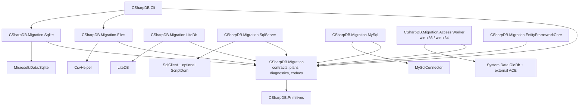

# Migration Tooling Phase 0 Decisions

Decision and qualification record for Phase 0 of the
[migration tooling execution roadmap](migration-tooling-execution-phases.md).
Evidence was reviewed on July 21, 2026.

## Outcome

Phase 0 is complete for the portable foundation and MVP. The recommended
product defaults are accepted as the working contract. Provider dependencies
remain outside `CSharpDB.Migration`, the first target is a local staged CSharpDB
file, and CSV, JSON/NDJSON, and SQLite remain the first public release.

Access is a **conditional go** in a separate Windows helper. Its local x64
provider path is viable, but it cannot ship until project-owned `.mdb` and
`.accdb` fixtures pass the bitness, read-only, schema, and data gates below.
This does not block portable Phase 1 work.

## Product Decisions

| ID | Decision | Status | Consequence |
| --- | --- | --- | --- |
| MIG-DEC-001 | Build one `csharpdb migrate` suite with a versioned catalog, plan, diagnostic, resume, validation, and report model. | Accepted | Adapters extend one workflow instead of becoming independent import utilities. |
| MIG-DEC-002 | Define the first public MVP as CSV, JSON/NDJSON, SQLite, shared type mapping, and schema/count/checksum validation. | Accepted | LiteDB, server analysis, Access, SQL compatibility, and dual run cannot expand the first release gate. |
| MIG-DEC-003 | Use preserve-first type mapping. Lossy conversions require a stable diagnostic-specific override. | Accepted | Ambiguous values default to a lossless representation such as canonical `Text`; no broad “allow loss” switch is permitted. |
| MIG-DEC-004 | Map LiteDB collections to CSharpDB collections by default. | Accepted | Relational projection and document flattening remain explicit later policies. |
| MIG-DEC-005 | Isolate Access in an optional Windows process/package using the Microsoft 365 Access Runtime. | Conditional go | No ACE/OLE DB dependency enters portable packages; x86 and x64 are qualified separately. |
| MIG-DEC-006 | Use approved managed providers in their adapter packages only. | Accepted | CsvHelper and Microsoft.Data.Sqlite are approved for the MVP; LiteDB, MySqlConnector, ScriptDom, and OleDb remain in their later optional components. |
| MIG-DEC-007 | Defer production dual writes, CDC, continuous replication, and zero-downtime cutover. | Accepted | The first assurance path is staged, offline, resumable, and read-only at the source. |
| MIG-DEC-008 | Embed a versioned CSharpDB capability catalog that matches the installed binary. | Accepted | Runtime compatibility claims do not depend on mutable website documentation. |
| MIG-DEC-009 | Implement the first target as a local staged file over typed engine `InsertBatch` transactions. | Accepted | Remote bulk migration waits for a prepared-batch client contract; the current SQL-literal pipeline destination is not used as the migration writer. |
| MIG-DEC-010 | Digest every durable artifact, expose no credential fields, use structured safe source identity, and scan common secret shapes as defense in depth. | Accepted | Catalogs and plans contain only non-secret source identity; provider adapters validate their identity structures and connection secrets remain ephemeral and out of band. |
| MIG-DEC-011 | Do not call native table archives a complete safety net until the archive-fidelity gate passes. | Accepted | Archive repair is a parallel foundation workstream, not a shortcut around staged execution and validation. |
| MIG-DEC-012 | Use only project-authored synthetic fixtures with recorded provenance and hashes. | Accepted | Customer data and downloaded vendor samples such as Northwind are excluded from committed test data. |

## Package Boundaries



Rules for this graph:

- `CSharpDB.Migration` has no CSV, database-provider, native-runtime, Admin, or
  server dependency.
- Existing Pipelines, ImportExport, and DevOps features are reached through
  adapters; provider dependencies are not added to those packages merely to
  support migration.
- The CLI references only the adapters included in a given distribution.
- Access remains a child process boundary so native bitness and provider
  discovery cannot compromise cross-platform packages.

## Dependency Qualification

Versions are initial pins for implementation and qualification, not a policy of
automatically adopting every later release.

| Dependency | Initial decision | License | Package placement and notes |
| --- | --- | --- | --- |
| [CsvHelper 33.1.0](https://www.nuget.org/packages/CsvHelper/) | Approve for the file adapter. | MS-PL or Apache-2.0; select Apache-2.0 in notices. | Managed-only and compatible with `net10.0`. Use for RFC 4180 parsing; do not expose its types in core contracts. |
| [Microsoft.Data.Sqlite 10.0.10](https://www.nuget.org/packages/Microsoft.Data.Sqlite/) | Approve for the SQLite MVP adapter. | MIT | Keep native SQLitePCLRaw assets isolated in the adapter and run published-RID tests. See Microsoft's [native bundle guidance](https://learn.microsoft.com/en-us/dotnet/standard/data/sqlite/custom-versions). |
| [SQLitePCLRaw.bundle_e_sqlite3 2.1.12](https://www.nuget.org/packages/SQLitePCLRaw.bundle_e_sqlite3/) | Pin initially; qualify v3 separately before repository-wide adoption. | Apache-2.0; SQLite is [public domain](https://www.sqlite.org/copyright.html). | The initial line embeds SQLite 3.53.3 and is the conservative match for the 2.1.x dependency range. |
| [LiteDB 5.0.21](https://www.nuget.org/packages/LiteDB/) | Approve for the later LiteDB adapter. | MIT | Qualify v5 datafiles only; exclude v6 prereleases and do not use in-place upgrade. |
| [MySqlConnector 2.6.1](https://www.nuget.org/packages/MySqlConnector/) | Approve for the optional MySQL analyzer. | MIT | Require at least 2.6.1 because its [release history](https://mysqlconnector.net/overview/version-history/) records the security fix following 2.6.0. |
| [ScriptDom 180.37.3](https://www.nuget.org/packages/Microsoft.SqlServer.TransactSql.ScriptDom/) | Conditional approval for the SQL Server analyzer; defer from foundation/MVP. | MIT | Keep the roughly 20 MB parser in the optional SQL Server package. Parsing is evidence level 1, not proof of binding or equivalence. Source is maintained at [SqlScriptDOM](https://github.com/microsoft/SqlScriptDOM). |
| [System.Data.OleDb 10.0.10](https://www.nuget.org/packages/System.Data.OleDb/) | Approve only for the Access worker. | MIT | Windows-only managed bridge; it does not provide ACE. Do not reference it from core. |
| [Microsoft 365 Access Runtime](https://support.microsoft.com/en-US/Access/download-and-install-microsoft-365-access-runtime) | External prerequisite, conditional on the completed native spike. | Microsoft runtime terms | Publish separate `win-x86` and `win-x64` workers. Do not bundle or auto-install the runtime without legal approval. |

The retired Access Database Engine 2016 Redistributable is not a supported
prerequisite; its extended support ended October 14, 2025 according to the
[Microsoft lifecycle entry](https://learn.microsoft.com/en-us/lifecycle/products/access-database-engine-2016-redistributable).

## Initial Source Qualification Matrix

| Source | First public qualification | Initially excluded |
| --- | --- | --- |
| SQLite | Ordinary unencrypted SQLite 3-format files read through bundled SQLite 3.53.3 in read-only mode. Record `sqlite_version()` and compile options. Include fixtures created by an older 3.8.x engine, 3.37.x, 3.46.1, and 3.53.3. SQLite describes compatibility by [file format](https://www.sqlite.org/formatchng.html), not a reliably encoded creator version. | SQLite 2, SQLCipher/SEE, custom encrypted builds, and databases requiring unqualified loadable extensions. |
| LiteDB | LiteDB v5 datafiles, including early-v5 and 5.0.21 fixtures, opened with `ReadOnly=true`. | v4 and older without an explicit copy-upgrade workflow, v6 prereleases, and encrypted files until secret handling and fixtures are qualified. |
| SQL Server | On-premises SQL Server 2019, 2022, and 2025 at default compatibility levels 150, 160, and 170, using the latest serviced build in qualification. | Azure SQL Database, Managed Instance, Synapse, Fabric, and lower compatibility levels until independently tested. See Microsoft's lifecycle pages for [2019](https://learn.microsoft.com/en-us/lifecycle/products/sql-server-2019), [2022](https://learn.microsoft.com/en-us/lifecycle/products/sql-server-2022), and [2025](https://learn.microsoft.com/en-us/lifecycle/products/sql-server-2025). |
| MySQL | Oracle MySQL 8.4 LTS with InnoDB. A separately labeled legacy lane may qualify MySQL 8.0.34-8.0.46 if demand justifies it. | MySQL 9.x, MariaDB, Aurora, Percona, and other protocol-compatible variants. Oracle's [release model](https://dev.mysql.com/doc/refman/8.4/en/mysql-releases.html) is the version authority. |
| Access | After the native gate passes: ordinary local tables in Access 2007-current `.accdb`, plus Access 2000 and Access 2002-2003 `.mdb`. | Access 97 and older, `.mde`, `.accde`, `.adp`, database/workgroup passwords, linked-table traversal, forms, reports, macros, VBA, and complex fields until individually tested. See Microsoft's [format guidance](https://support.microsoft.com/en-US/Access/which-access-file-format-should-i-use). |

Only executable fixtures can move an entry from detected/unqualified to
publicly supported. Protocol compatibility and successful connection are not
sufficient.

## Fixture And Test-Data Policy

Every committed binary or byte-exact fixture must have a provenance entry with:

- a stable fixture ID and source kind;
- the project-owned generator and pinned generator/provider version;
- a reproducible generation command or script;
- SHA-256 of the committed bytes;
- expected catalog, mapping, diagnostics, and validation behavior;
- project ownership/license confirmation;
- confirmation that the fixture contains no credentials or customer data;
- whether opening the fixture is proven non-mutating.

Fixture tiers:

| Source | Small committed fixtures | Generated or live qualification |
| --- | --- | --- |
| CSV | Byte-exact CRLF, quoting/multiline, null/empty/missing, BOM/no-BOM, UTF-16LE, invalid UTF-8, delimiter, malformed-record, and culture-looking values. | Seeded large files, cancellation, rejection, and resume faults. |
| JSON/NDJSON | Missing versus null, duplicate properties, exact number lexemes, nested values, Unicode/encoding failures, malformed input, and typed sidecars. | Seeded large streams, spill, cancellation, and memory tests. |
| SQLite | Project-generated `.sqlite` files for ordinary schema, keys/constraints/indexes, BLOB/null, affinity mixtures, `STRICT`, `WITHOUT ROWID`, generated/partial/expression indexes, and unsupported virtual tables. | WAL/concurrent-writer snapshot tests with source hashes captured before and after. |
| LiteDB | Project-generated v5 files with all BSON types, `_id` variants, missing/null, nesting, indexes, DBRef, and file-storage diagnostics. | Larger generated databases; never open legacy files with `Upgrade=true`. |
| SQL Server and MySQL | Project-authored DDL/seed SQL and golden normalized catalog/diagnostic JSON. Do not commit server data directories, backups, or vendor samples. | Exact-tag/digest ephemeral server jobs with generated credentials and no retained data. |
| Access | Subject to legal review, project-created Access 2000/2002-2003 `.mdb` and current `.accdb` files with generator version and hashes. Do not use Northwind or execute macros/VBA. | Persistent qualified Windows x86/x64 VMs; normal hosted CI tests build and provider-absent behavior. |

The repository currently ignores several required fixture extensions and applies
text normalization broadly. Before binary fixtures are committed, add narrow
fixture-directory allowlists to `.gitignore` and `-text` rules to
`.gitattributes`; do not weaken those files globally.

## Access Feasibility Decision

### Local probe result

- The probe ran on Windows 25H2 build 26200.8894 on an x64 OS/process. The
  installed SDK is 10.0.203; the x64 runtime/host is 10.0.10 and an x86
  10.0.9 runtime is also installed.
- Microsoft 365 Click-to-Run is x64. `MSACCESS.EXE` is version
  16.0.20228.20102 and the registered x64 `ACEOLEDB.DLL` is
  16.0.20228.20014.
- The current x64 Windows/.NET 10 process can enumerate ACE 12.0 and 16.0 OLE
  DB providers, backed by an x64 `ACEOLEDB.DLL` registration.
- The x86 provider view exposes Jet 4.0 but no x86 ACE registration on this
  machine.
- `System.Data.OleDb` has a Windows-supported `net10.0` asset, so the managed
  API path is viable.
- No project-owned `.mdb` or `.accdb` fixture is currently available, so file
  opening, schema rowsets, value fidelity, and source immutability remain
  unproven.

### Decision

Proceed as a conditional spike in `CSharpDB.Migration.Access.Worker`, published
separately for `win-x64` and `win-x86`. The worker must diagnose provider
absence and bitness mismatch before attempting to open a source. ACE remains an
external prerequisite.

Use one `net10.0-windows` executable project published twice as untrimmed,
non-AOT, self-contained output. An x64 SDK can publish the x86 artifact; a
separate x86 SDK is not required. Probe providers inside each child process and
verify the registered COM server architecture. A 64-bit registry reader can
observe shared ProgID names even when the matching 32-bit `InprocServer32` is
absent. Jet 4.0 is detected-but-unsupported in the first qualification.

The Access qualification lanes are:

| Lane | Environment | Required result |
| --- | --- | --- |
| Portable | Existing Linux, macOS, and Windows CI | Core builds and tests with no OLE DB dependency. |
| Helper smoke x64/x86 | Hosted Windows without ACE | Both self-contained workers report their architecture and a stable provider-missing diagnostic. |
| ACE x64 | Dedicated Windows VM with x64 Microsoft 365 Access Runtime | Project-owned `.mdb` and `.accdb` fixtures pass. |
| ACE x86 | Separate Windows VM with x86 Microsoft 365 Access Runtime | The same logical fixture matrix passes. |
| Mismatch | Each provider VM with the opposite worker | Stable bitness-mismatch diagnostic, never a raw native-load failure. |

Microsoft's [Office bitness guidance](https://support.microsoft.com/en-us/office/choose-between-the-64-bit-or-32-bit-version-of-office-2dee7807-8f95-4d0c-b5fe-6c6f49b8d261)
supports keeping the x86 and x64 native lanes on separate machines. Hosted
Windows images are suitable for provider-absent smoke tests; provider-backed
qualification uses maintained dedicated runners.

### Go/Defer Gates

- [ ] Generate or legally approve one project-owned modern `.accdb`, one Access
  2000 `.mdb`, and one Access 2002-2003 `.mdb` fixture.
- [ ] Open each fixture read-only through matching x64 and x86 ACE runtimes and
  prove its SHA-256 is unchanged before/after inspection and row streaming.
- [ ] Qualify table/column metadata, AutoNumber, PK/FK, indexes, defaults,
  common scalar values, nulls, BLOB/OLE values, Unicode, date/time, and decimal
  boundaries.
- [ ] Inventory saved queries, linked tables, attachments, multivalued and
  calculated fields, forms, reports, macros, and VBA without executing them.
- [ ] Verify provider-absent, wrong-bitness, locked-file, corrupt-file,
  password-protected, and unsupported-format diagnostics.
- [ ] Establish build-only/provider-absent hosted CI plus persistent x86/x64
  native qualification runners.
- [ ] Complete legal review for fixture binaries, runtime prerequisites, and
  redistribution wording.

If any native/runtime gate cannot be supported repeatably, defer Access without
changing the portable migration contracts.

## Archive Fidelity Decision

The current archive reader/writer remains useful as a source of schema and row
models, but it is not a complete migration restore boundary. Before archives
are presented as a safety net, the archive workstream must:

1. Separate physical PK lookup metadata from logical secondary indexes.
2. Reject row-shape, type, and nullability violations instead of trimming or
   padding values.
3. Validate bounded section sizes/ranges, exact row-section consumption,
   cross-metadata agreement, and integrity digests.
4. Write atomically and define an explicit overwrite/finalization policy.
5. Replace the in-memory O(N) PK-index build with spill/external sort or a
   documented no-index mode.
6. Restore defaults, checks, composite/unique keys, foreign keys, secondary
   indexes, `NextRowId`, renamed self-references, and rowversion exclusions.
7. Use typed staged writes with cleanup/resume behavior and post-load
   schema/count/checksum validation.
8. Preserve immutable v3/v4 compatibility fixtures while introducing any
   later format version.

The exit gate is an empty normalized schema diff plus matching 64-bit count and
canonical hash, except for documented regenerated rowversion values. Injected
failure must expose no partial target.

### Archive workstream status (July 22, 2026)

Implemented in the Phase 2 slice:

- v5 logical secondary-index metadata, separate from the physical PK lookup;
- immutable v3/v4 read compatibility and version gating;
- strict row shape/type/nullability checks and bounded, canonical sections;
- atomic path publication and preservation of an existing destination on a
  failed write;
- defaults, checks, ordered composite/unique keys, foreign keys, secondary
  indexes, renamed self-references, rowversion regeneration, and durable
  `NextRowId` reseeding;
- required SHA-256 digests for schema, row, and physical-index sections on
  every new v5 archive, verified by every reader path before data is served;
- a 65,536-entry physical PK-index construction cap with a documented,
  complete scan-only archive above the bound;
- staged restore activation, exact 64-bit count and normalized-schema
  validation, caught-failure cleanup, and a durable lease/ownership journal
  that reclaims matching abandoned staging after process restart.

Still required before the archive is a complete safety boundary:

- a post-load canonical row hash using the versioned `csharpdb-canon-v1`
  contract and bounded spill algorithm defined in Phase 3. Raw archive section
  digests protect the archive bytes but do not replace logical source/target
  equality validation.

## Immediate Implementation Backlog

### Phase 1: Contracts And Planning

1. Add `CSharpDB.Migration` and `CSharpDB.Migration.Tests`.
2. Define the versioned catalog/plan envelope, diagnostics, compatibility and
   evidence states, mapping classifications, profiling coverage, digests, and
   secret rejection.
3. Define inspector, streaming source, type mapping, target, snapshot, and
   validation interfaces.
4. Add the version-matched CSharpDB capability catalog.
5. Build an awkward synthetic source and deterministic name planner.
6. Add CLI `inspect`, `plan`, and `preview` over the synthetic source.

### Phase 2: Safe Apply And Resume

1. Add a local staged-file target over typed `InsertBatch` transactions.
2. Persist each batch receipt in the same transaction as its rows.
3. Reject plan, source, snapshot, target, and completed-batch digest changes on
   resume.
4. Add commit-boundary fault injection and prove no missing/duplicate rows.
5. Run the archive-fidelity workstream in parallel.

### Phase 3: Validation And Foundation Gate

1. Define `csharpdb-canon-v1` and golden vectors.
2. Add snapshot-consistent 64-bit counts and bounded-memory partitioned
   checksums with deterministic spill.
3. Persist a final digested report before staged-target activation.
4. Pass the synthetic end-to-end gate:

```text
inspect -> plan -> preview -> staged apply -> injected crash
        -> resume -> schema/count/checksum validate -> report
```

Production CSV, JSON, and SQLite adapters remain gated on that scenario.

## Phase 0 Exit Check

- [x] The eight product defaults are accepted as the working contract.
- [x] Portable package boundaries and dependency placement are decided.
- [x] Initial source-version qualification boundaries are recorded.
- [x] Project-owned fixture and provenance policy is defined.
- [x] Access has a conditional packaging direction and explicit defer gates.
- [x] Archive fidelity gaps have a separate foundation gate.
- [x] The first Phase 1-3 backlog is ordered.

Portable Phase 1 implementation is authorized. Access remains non-shipping
until every native gate is checked.
